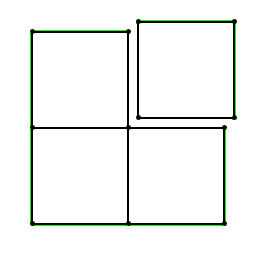
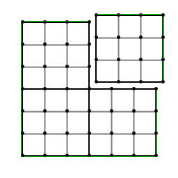
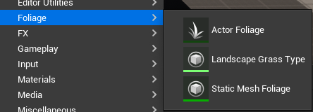
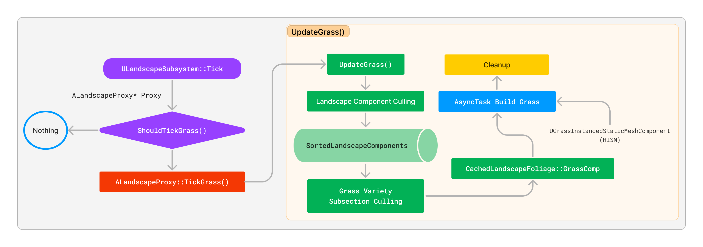
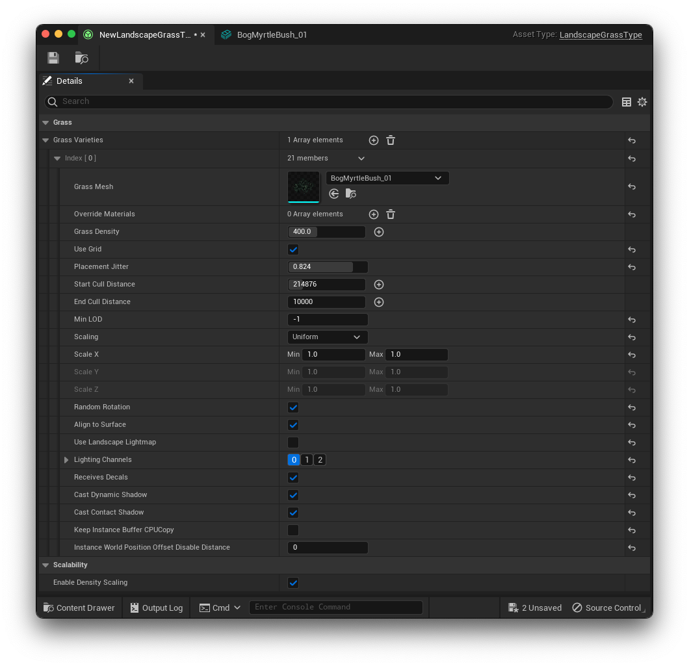
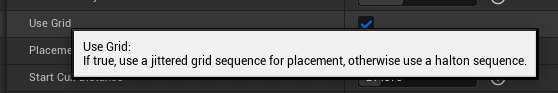

_This article aims to analyze and summarize the principles behind the grass planting part of the Landscape Grass system in Unreal Engine 4.27 / 5. Please note that due to the author's expertise, there may be some inaccuracies in the content. Therefore, it is recommended to refer to relevant resources and source code for more comprehensive and accurate information._


For instructions on how to use Landscape Grass, refer to the official documentation [Grass Quick Start](https://docs.unrealengine.com/5.2/en-US/grass-quick-start-in-unreal-engine/).

## Gameplay Architecture Overview

Since Landscape is based on UE's Subsystem architecture, it is helpful to familiarize yourself with the inheritance relationships and lifecycle of relevant components before diving into the source code.

> Recommended reading: [《InsideUE4》GamePlay 架构（十一）Subsystems](https://zhuanlan.zhihu.com/p/158717151) (zh-cn)

The Landscape Subsystem is a Tickable World Subsystem, and `ULandscapeSubsystem` inherits the following hierarchy [^ULandscapeSubsystem]:

[^ULandscapeSubsystem]: [ULandscapeSubsystem | Unreal Engine Documentation](https://docs.unrealengine.com/5.2/en-US/API/Runtime/Landscape/ULandscapeSubsystem/)

```text /ULandscapeSubsystem/
- UObjectBase
  - UObjectBaseUtility
    - UObject
      - USubsystem
        - UWorldSubsystem
          - UTickableWorldSubsystem
            - ULandscapeSubsystem
```

The inheritance hierarchy of Landscape Actors in the scene [^ALandscape]:

```text /ALandscape/
- UObjectBase
  - UObjectBaseUtility
    - UObject
      - AActor
        - APartitionActor
          - ALandscapeProxy
            - ALandscape
```

[^ALandscape]: [ALandscape | Unreal Engine Documentation](https://docs.unrealengine.com/5.1/en-US/API/Runtime/Landscape/ALandscape/)

`ALandscape` inherits from `ALandscapeProxy`, and `ALandscapeProxy` contains the main information about the Landscape. `ALandscape` is the specific implementation of Landscape Actors in the engine.

## Landscape Basics

To understand the foundation of the UE Landscape design framework, refer to the official documentation [Landscape Technical Guide](https://docs.unrealengine.com/5.2/en-US/landscape-technical-guide-in-unreal-engine/). Here is a brief overview. The diagrams are sourced from the official documentation.

### Landscape Component

In the Landscape framework, the Landscape Component is the smallest unit of processing and the basic rendering unit. When creating a Landscape, all Landscape Components are initially square and of equal size.



### Component Section (Subsection)

Landscape Components house Component Sections. The engine offers the option of having 1x1 or 2x2 Sections per Component.

Component Subsections are primarily used for terrain LOD calculation to enhance terrain resolution and performance. Typically, each Section generates a draw call, but due to camera distance, multiple Sections can be merged into a single draw call (1x1 section per component or 2x2 section per component merged into a draw call).



## Foliage in UE5

Before diving into Landscape Grass, let's first understand the different methods of creating vegetation in UE5 and why we choose Landscape Grass as the solution for rendering large-scale vegetation. In the UE5's Content Browser, right-click and select Foliage:



We can categorize these three types of Foliage into the following two categories:

-   [Foliage Mode](https://docs.unrealengine.com/5.2/en-US/foliage-mode-in-unreal-engine/)
    -   Static Mesh Foliage
    -   Actor Foliage
-   [Landscape Grass](https://docs.unrealengine.com/5.2/en-US/grass-quick-start-in-unreal-engine/)

For Foliage Mode, we can summarize as follows:

| **Type**                | **Description**[^foliagemode]                                                                                                          | Performance                                                                |
| :---------------------- | :------------------------------------------------------------------------------------------------------------------------------------- | -------------------------------------------------------------------------- |
| **Actor Foliage**       | Foliage type that places Blueprint or Native Actor instances in the scene. **High densities of foliage can cause performance issues.** | The cost of painting this foliage is the same as adding actors in a scene. |
| **Static Mesh Foliage** | Foliage type that uses mesh instancing. This type is best for non-destructive foliage.                                                 | Use **mesh instancing**, optimal for non-interactive foliage.              |

[^foliagemode]: [Foliage Mode in Unreal Engine | Unreal Engine 5.2 Documentation](https://docs.unrealengine.com/5.2/en-US/foliage-mode-in-unreal-engine)

The difference between Actor Foliage and Static Mesh Foliage is that the former is essentially adding an Actor to the scene, while the latter uses mesh instancing to render vegetation in batches. Static Mesh Foliage in the engine is typically non-interactive and can be manually painted using the [Foliage Tool](https://docs.unrealengine.com/5.2/en-US/foliage-mode-in-unreal-engine/) or procedurally generated using the [Procedural Foliage Tool](https://docs.unrealengine.com/5.1/en-US/procedural-foliage-tool-in-unreal-engine/). On the other hand, Landscape Grass provides a better workflow and performance for creating large-scale vegetation. It dynamically loads **Hierarchical Instanced Static Mesh (HISM)** into the scene through streaming (similar to InstancedFoliage). Although Landscape Grass is named "Grass", it can be used to plant any desired vegetation mesh.

## Grass Planting Process



## Preparing for Planting

The Landscape Subsystem decides whether to tick the grass during its Tick function: `ShouldTickGrass()`

```cpp filename="LandscapeSubsystem.cpp" {17}
void ULandscapeSubsystem::Tick(float DeltaTime)
{
	...
	Super::Tick(DeltaTime);

	UWorld* World = GetWorld();
	// update cameras
	...
	int32 InOutNumComponentsCreated = 0;
	for (TWeakObjectPtr<ALandscapeProxy> ProxyPtr : Proxies)
	{
		if (ALandscapeProxy* Proxy = ProxyPtr.Get())
		{
			...
			if (Cameras && Proxy->ShouldTickGrass())
			{
				Proxy->TickGrass(*Cameras, InOutNumComponentsCreated);
			}

			Proxy->UpdateRenderingMethod(); // UE5: NaniteLandscape stuff
		}
	}
	...
}
```

When Landscape Grass is enabled, it mainly checks if a certain time interval has elapsed to prevent unnecessary overhead from updating grass every frame. In the Editor, the interval is always set to 1, meaning it updates every frame.

```cpp filename="LandscapeProxy.h" /UpdateInterval/
/* Per-frame call to update dynamic grass placement and render grassmaps */
FORCEINLINE bool ShouldTickGrass() const
{
	// At runtime if we don't have grass we will never have any so avoid ticking it
	// In editor we might have a material that didn't have grass and now does so we can't rely on bHasLandscapeGrass.
	if (!GIsEditor && !bHasLandscapeGrass)
	{
		return false;
	}

	const int32 UpdateInterval = GetGrassUpdateInterval();
	if (UpdateInterval > 1)
	{
		if ((GFrameNumber + FrameOffsetForTickInterval) % uint32(UpdateInterval))
		{
			return false;
		}
	}

	return true;
}
```

In Game, outside of the Editor, you can set the update interval using the Console Variable `grass.TickInterval`, which is clamped between 1 and 60.

> In "Fortnite," the TickInterval is set to 10 [^fortnite_grass_tickinterval]

[^fortnite_grass_tickinterval]: [Adjusting How Fast Landscape Grass Appears](https://forums.unrealengine.com/docs?topic=506003)

```cpp filename="LandscapeGrass.cpp"{6}
static void GrassCVarSinkFunction()
{
	...
	if (FApp::IsGame())
	{
		ALandscapeProxy::SetGrassUpdateInterval(FMath::Clamp<int32>(GGrassTickInterval, 1, 60));
	}
  ...
}
```

With the preparation complete, the grass ticking begins. Some performance metrics and Editor-specific logic are handled, and then it enters the grass update process through `UpdateGrass()`.

```cpp filename="LandscapeGrass.cpp" {12}
//
// ALandscapeProxy grass-related functions
//

void ALandscapeProxy::TickGrass(const TArray<FVector>& Cameras, int32& InOutNumCompsCreated)
{
	TRACE_CPUPROFILER_EVENT_SCOPE(ALandscapeProxy::TickGrass);
#if WITH_EDITORONLY_DATA
	...
#endif

	UpdateGrass(Cameras, InOutNumCompsCreated);
}
```

## Data Structure: GrassData and GrassType



As mentioned earlier, the vegetation planted using Landscape Grass doesn't have to be limited to "grass." It can be any desired vegetation mesh. Therefore, let's take a look at the data involved in planting vegetation.

GrassData primarily serves as a mapping for rendering data. Landscape Grass streams specific vegetation Hierarchical Instanced Static Meshes (HISMs) into the scene at the appropriate time. To achieve this, it needs information about the loaded vegetation data (GrassType) and the spatial distribution of the vegetation. The distribution of grass positions is determined by a weightmap, and a heightmap is used to determine the spatial position of the grass to prevent vegetation from floating or sinking into the ground.

GrassType is a container that can hold different types of vegetation meshes, known as GrassVarieties. The purpose of GrassVarieties is to avoid repetitive vegetation patterns. In the screenshot above, GrassType contains an array called GrassVarieties, which can hold multiple GrassVariety objects. Each GrassVariety controls specific information related to grass placement, such as grass density, random placement algorithm (Grid/Halton), instance cull distance, and more.

GrassData exists offline within the LandscapeComponent. It is only updated when the `EditorBuildGrassMaps` is called only in the Editor.

```cpp filename="LandscapeComponent.h"
/** Grass data for generation **/
TSharedRef<FLandscapeComponentGrassData, ESPMode::ThreadSafe> GrassData;

struct FLandscapeComponentGrassData
{
	...
	// UE4 implementation:
	// TArray<uint16> HeightData;
	// TMap<ULandscapeGrassType*, TArray<uint8>> WeightData;
	// UE5:
	// Serialized in one block to prevent Slack waste
	TMap<ULandscapeGrassType*, int32> WeightOffsets;
	TArray<uint8> HeightWeightData;
	...
}
```

In UE5, the storage layout for grass weight and height has been optimized. It uses a continuous array along with offsets to retrieve the data, improving cache hit rates:

```cpp filename="LandscapeGrass.h"
TArrayView<uint8> FLandscapeComponentGrassData::GetWeightData(const ULandscapeGrassType* GrassType)
{
	if (!HeightWeightData.IsEmpty())
	{
		if (int32* OffsetPtr = WeightOffsets.Find(GrassType))
		{
			int32 Offset = *OffsetPtr;
			check(Offset + NumElements <= HeightWeightData.Num());
			check(NumElements);
			return MakeArrayView<uint8>(&HeightWeightData[Offset], NumElements);
		}
	}

	return TArrayView<uint8>();
}

TArrayView<uint16> FLandscapeComponentGrassData::GetHeightData()
{
	if (HeightWeightData.IsEmpty())
	{
		return TArrayView<uint16>();
	}

	check(NumElements <= HeightWeightData.Num());
	return MakeArrayView<uint16>((uint16*)&HeightWeightData[0], NumElements);
}
```

Regarding how the weight and height data in GrassData are constructed, you can refer to the source code for the function, but we won't delve into it here.

```cpp
void FLandscapeComponentGrassData::InitializeFrom(const TArray<uint16>& HeightData, const TMap<ULandscapeGrassType*, TArray<uint8>>& WeightData)
```

The grass planted with Landscape Grass and the foliage placed using the Foliage Tool (Static Mesh Foliage / InstancedFoliage) are both HISM components. This will be covered in the subsequent flow.

## Grass Update Phase

The `UpdateGrass()` function is called by TickGrass.

Before actually planting the grass, some preparations are made to obtain the following information from the current LandscapeMaterial output:

| Type   | Name                        | Description                                                                                                                                     |
| ------ | --------------------------- | ----------------------------------------------------------------------------------------------------------------------------------------------- |
| TArray | **Landscape Grass Types**   | The Landscape Material can accept multiple Grass Types                                                                                          |
| float  | **GrassMaxDiscardDistance** | Discards grass beyond the farthest culling distance by iterating through all Grass Types -> Grass Varieties to find the maximum EndCullDistance |

### Overview of the Update Logic

The general sequence of operations in `UpdateGrass()` is as follows:

1. _Landscape Component Culling_: Iterate through all Landscape Components, perform culling based on camera distance, and output `SortedLandscapeComponents`.

2. _Grass Variety Subsection Culling_: Iterate through the Grass Varieties under `SortedLandscapeComponents` (the order is to iterate through all Landscape Grass Types -> Grass Varieties), and perform Grass Variety Subsection Culling based on camera distance.

3. Introduce the data structure `FCachedLandscapeFoliage::FGrassComp` to store the information of grass that will be generated. If there is no GrassData in the editor, generation will be triggered here.

4. Create `HierarchicalInstancedStaticMeshComponent` (HISM Comp), fill in the data. Each Grass Variety has its own HISM Comp (similar to how InstancedFoliage is handled).

    1. If LOD is present, perform the corresponding operations (LightMap, ShadowMap, ResourceCluster).
    2. Write Instance Culling data (used for visibility culling).

5. Create AsyncGrassBuilder, push it into the AsyncTask queue, and call `StartBackgroundTask()`.

    > The asynchronous task is responsible for grass rendering, instance generation, and more.

6. Register HISM Comp in the world.

7. Cleanup work.

### Landscape Component Culling

Landscape Component Culling determines whether a specific Landscape Component needs to process grass. It iterates through all Landscape Components of the current Landscape.

The distance between the camera and the Bounding Box of the `LandscapeComponent` is used for evaluation. If the distance is outside the specified range, the component is skipped.

```cpp filename="LandscapeGrass.cpp" {12-15}
for (ULandscapeComponent* Component : LandscapeComponents)
{
	// skip if we have no data and no way to generate it
	...
	FBoxSphereBounds WorldBounds = Component->CalcBounds(Component->GetComponentTransform());
	float MinSqrDistanceToComponent = Cameras.Num() ? MAX_flt : 0.0f;
	for (const FVector& CameraPos : Cameras)
	{
		MinSqrDistanceToComponent = FMath::Min<float>(MinSqrDistanceToComponent, WorldBounds.ComputeSquaredDistanceFromBoxToPoint(CameraPos));
	}

	if (MinSqrDistanceToComponent > GrassMaxSquareDiscardDistance)
	{
		continue;
	}
  ...
}
```

1. Obtain the `SortedLandscapeComponents` that need to be processed and iterate through them.
2. Perform intersection tests between the Bounding Box of each component and `GGrassExclusionBoxes`. If there is an intersection, add the FBox of the ExclusionBox to the ActiveExcludedBoxes of the component for later use.

### Grass Variety Subsection Culling

To further optimize the generation range of grass for culled landscape components, the concept of Grass Variety Subsections is introduced. It's important to note that these subsections are **not related to Landscape Component SubSections** and have no impact on Landscape rendering.

This step focuses on culling a specific Grass Variety. It compares the camera distance with the processed End Cull Distance of that Grass Variety to determine whether it needs to be generated. If it's not needed, it is discarded, and the current loop is exited.

For a Variety to be processed, it must meet the following criteria: it has a mesh, a density, and EndCullDistance > 0. Otherwise, that Variety is skipped.

The number of subsections is clamped between 1 and 16, with each subsection being a square.

```cpp
if (ForSubsectionMath.bHaveValidData && ForSubsectionMath.SqrtMaxInstances > 0)
{
    SqrtSubsections = FMath::Clamp<int32>(FMath::CeilToInt(float(ForSubsectionMath.SqrtMaxInstances) / FMath::Sqrt((float)MaxInstancesPerComponent)), 1, 16);
    // ^ MaxInstancesPerComponent = max(1024, grass.MaxInstancesPerComponent)
}
int32 MaxInstancesSub = FMath::Square(ForSubsectionMath.SqrtMaxInstances / SqrtSubsections);
```

> CVar: `grass.MaxInstancesPerComponent` sets the `MaxInstancesPerComponent`, with a default value of 65536 and a minimum value of 1024.

`MaxInstancesSub` represents the maximum number of instances on a single subsection. It is used for Halton random placement and is not required for the Jittered Grid method.

With the completion of the landscape component and grass variety subsection culling, no specific grass data is loaded into memory, and there is no visibility culling at this stage.

### Exclusion Boxes Intersection Test

It's worth noting that the `LandscapeProxy` provides an `ExclusionBox` interface, which is speculated to be used for preventing grass generation in certain areas (e.g., buildings). In the distance culling steps mentioned earlier, there is a corresponding intersection test. However, after examining the search engine code, no direct usage of these interfaces was found.

```cpp
static TMap<FWeakObjectPtr, FBox> GGrassExclusionBoxes;

void ALandscapeProxy::AddExclusionBox(FWeakObjectPtr Owner, const FBox& BoxToRemove)
{
    GGrassExclusionBoxes.Add(Owner, BoxToRemove);
    GGrassExclusionChangeTag++;
}

void ALandscapeProxy::RemoveExclusionBox(FWeakObjectPtr Owner)
{
    GGrassExclusionBoxes.Remove(Owner);
    GGrassExclusionChangeTag++;
}

void ALandscapeProxy::RemoveAllExclusionBoxes()
{
    if (GGrassExclusionBoxes.Num())
    {
        GGrassExclusionBoxes.Empty();
        GGrassExclusionChangeTag++;
    }
}
```

### GrassComp

Here, the culling part is finished, and we are ready to handle grass rendering. We introduce a new class called `FCachedLandscapeFoliage` and a data structure called `FCachedLandscapeFoliage::FGrassComp`.

1. Structure granularity: `FCachedLandscapeFoliage::FGrassComp` stores the **Foliage HISM Comp** of a single grass variety, the corresponding landscape component, grass variety subsection coordinates, and the parent Grass Type of this grass variety.
2. Structure purpose: It is used to build the Foliage HISM Comp for this grass variety later and also stores the existing Foliage HISM Comps.

It is important to note that the actual planting of grass is done with HISM Comp. As the class name suggests, this is only used for caching purposes in Landscape Grass.

Analyzing the source code, we can see that `UpdateGrass()` is called once every tick, and by default, it creates one GrassComp per frame. However, this can be modified by the following console variable:

> CVar: `grass.MaxCreatePerFrame` sets the maximum number of HISM components created per frame, with a default value of 1. Increasing this value will result in faster grass planting but higher performance requirements.

```cpp
static int32 GGrassMaxCreatePerFrame = 1;
static FAutoConsoleVariableRef CVarGrassMaxCreatePerFrame(
	TEXT("grass.MaxCreatePerFrame"),
	GGrassMaxCreatePerFrame,
	TEXT("Maximum number of Grass components to create per frame"));
```

After creating the GrassComp, the asynchronous task for creating the HISM Comp is not started yet. At this point, the code checks the number of tasks in the current asynchronous task pool. If it has reached `MaxAsyncTasks`, the code exits the current loop (any ungenerated grass may wait until the next grass tick).

> CVar: `grass.MaxAsyncTasks` controls the maximum number of asynchronous tasks in a single `TickGrass`.

The key code for creating the HISM Comp is as follows:

```cpp
for (auto& GrassVariety : GrassType->GrassVarieties)
{
	if (GrassVariety.GrassMesh && GrassVariety.GrassDensity.GetValue() > 0.0f && EndCullDistance > 0)
	{
		for (int32 SubX = 0; SubX < SqrtSubsections; SubX++)
		{
			for (int32 SubY = 0; SubY < SqrtSubsections; SubY++)
			{
				// UE4: UHierarchicalInstancedStaticMeshComponent* HierarchicalInstancedStaticMeshComponent;
				// UE5 uses the new class UGrassInstancedStaticMeshComponent, which inherits from UGrassInstancedStaticMeshComponent
				UGrassInstancedStaticMeshComponent* GrassInstancedStaticMeshComponent;
				{
					QUICK_SCOPE_CYCLE_COUNTER(STAT_GrassCreateComp);
					GrassInstancedStaticMeshComponent = NewObject<UGrassInstancedStaticMeshComponent>(this, NAME_None, RF_Transient);
				}
				NewComp.Foliage = GrassInstancedStaticMeshComponent;
				FoliageCache.CachedGrassComps.Add(NewComp);
				...
```

The code then handles the HISM Comp-related data, such as the mesh, culling distance (rendering), LOD-related data (if applicable), and more. Here's an example:

```cpp
const FMeshMapBuildData* MeshMapBuildData = Component->GetMeshMapBuildData();

if (GrassVariety.bUseLandscapeLightmap
	&& GrassVariety.GrassMesh->GetNumLODs() > 0
	&& MeshMapBuildData
	&& MeshMapBuildData->LightMap)
{
	GrassInstancedStaticMeshComponent->SetLODDataCount(GrassVariety.GrassMesh->GetNumLODs(), GrassVariety.GrassMesh->GetNumLODs());

	FLightMapRef GrassLightMap = new FLandscapeGrassLightMap(*MeshMapBuildData->LightMap->GetLightMap2D());
	FShadowMapRef GrassShadowMap = MeshMapBuildData->ShadowMap ? new FLandscapeGrassShadowMap(*MeshMapBuildData->ShadowMap->GetShadowMap2D()) : nullptr;

	for (auto& LOD : GrassInstancedStaticMeshComponent->LODData)
	{
		// This trasient OverrideMapBuildData will be cleaned up by UMapBuildDataRegistry::CleanupTransientOverrideMapBuildData() if the underlying MeshMapBuildData is gone
		LOD.OverrideMapBuildData = MakeUnique<FMeshMapBuildData>();
		LOD.OverrideMapBuildData->LightMap = GrassLightMap;
		LOD.OverrideMapBuildData->ShadowMap = GrassShadowMap;
		LOD.OverrideMapBuildData->ResourceCluster = MeshMapBuildData->ResourceCluster;
	}
}
```

After that, we are ready to start the asynchronous task for planting grass.

## Asynchronous Planting

In the `UpdateGrass()` function, the program creates an `FAsyncGrassBuilder`. The builder is the smallest unit for the actual grass planting task.

```cpp filename="LandscapeGrass.cpp" {2,7-11}
...
	Builder = new FAsyncGrassBuilder(this, Component, GrassType, GrassVariety, FeatureLevel, GrassInstancedStaticMeshComponent, SqrtSubsections, SubX, SubY, HaltonIndexForSub, NewComp.ExcludedBoxes);
}

if (Builder->bHaveValidData)
{
	FAsyncTask<FAsyncGrassTask>* Task = new FAsyncTask<FAsyncGrassTask>(Builder, NewComp.Key, GrassInstancedStaticMeshComponent);

	Task->StartBackgroundTask();

	AsyncFoliageTasks.Add(Task);
}
else
{
	delete Builder;
}
{
	QUICK_SCOPE_CYCLE_COUNTER(STAT_GrassRegisterComp);

	GrassInstancedStaticMeshComponent->RegisterComponent();
}
...
```

Since HISM Comp utilizes GPU instancing, it can be inferred that a single HISM Comp stores the same mesh, which means it represents the same grass variety. Therefore, the grass variety serves as the smallest unit for generating batched grass.

### Random Placement Algorithms for Grass Variety



There are two algorithms for the random placement of grass variety:

1. **Jittered Grid Sequence**: The larger the jitter value, the more random it appears, while smaller values distribute grass more evenly within the grid (if "Use Grid" is set to true in the variety settings, this algorithm is used; otherwise, the Halton method is used).

2. **[Halton Sequence](https://web.maths.unsw.edu.au/~josefdick/MCQMC_Proceedings/MCQMC_Proceedings_2012_Preprints/100_Keller_tutorial.pdf)**: A low discrepancy pseudo-random sequence that generates a more uniform and randomized distribution of grass.

### Building Grass

The `FAsyncGrassBuilder::Build()` produces InstanceBuffer and ClusterTree.

TaskGraph - AnyThread

```cpp
UHierarchicalInstancedStaticMeshComponent::BuildTreeAnyThread(InstanceTransforms, InstanceCustomDataDummy, 0, MeshBox, ClusterTree, SortedInstances, InstanceReorderTable, OutOcclusionLayerNum, DesiredInstancesPerLeaf, false);
```

### Destroy

Check if the HISM Comp is still in use and clean up unused HISM Comp: `Component->DestroyComponent();`

## Summary of Grass Planting Principles

-   Overall, LandscapeGrass calculates the number of vegetation to load into memory (range) and asynchronously loads/unloads them based on parameters such as EndCullDistance in the grass variety.
-   The minimum granularity for distance culling is the grass variety subsection. Grass variety subsections without grass or outside the distance are directly discarded, and no grass is generated on them.
-   LandscapeGrass refines the number of Landscape Components (`SortedLandscapeComponents`) and, in turn, the number of grass variety subsections to control the number of generated instances.
-   Each grass variety in a grass variety subsection corresponds to an HISM Comp. This means that the same grass variety in the scene may have different HISM Comps (multiple grass variety subsections), and there is no one-to-one relationship. However, a grass variety on a single grass variety subsection corresponds to only one HISM Comp.
-   `ExclusionBoxes` can be set to block the generation of HISM Comps in specific areas.
-   `TickInterval` can be increased to reduce performance overhead, depending on the situation.

## Reference

1. [《InsideUE4》GamePlay 架构（十一）Subsystems](https://zhuanlan.zhihu.com/p/158717151)
2. [UE4 Mobile Landscape 总览及源码解析](https://zhuanlan.zhihu.com/p/144031549)
3. [UE4 中的植被工具](https://zhuanlan.zhihu.com/p/389430858)
4. [LearnOpenGL - Instancing](https://learnopengl.com/Advanced-OpenGL/Instancing)
5. [UE4 材质系统](https://papalqi.cn/ue4材质系统/)
6. [Halton Sequence](https://web.maths.unsw.edu.au/~josefdick/MCQMC_Proceedings/MCQMC_Proceedings_2012_Preprints/100_Keller_tutorial.pdf)

## Citation
