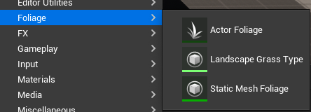

_本文试图对 Unreal Engine 4.7/5 中的 Landscape Grass (景观草地) 系统的原理进行分析梳理，并非引擎学习使用教程。受限于笔者水平，文中内容可能存在一定谬误，请同时参考相关资料和源代码以获取更全面和准确的信息。_

## Foliage in UE5

正式进入 Landscape Grass 之前，我们先了解一下在 UE4/5 里面制作植被的几种方式。在 Content Browser 中右键，选择 Foliage 可以看到：

我们可以将这三种 Foliage 分为以下两类：

-   [Foliage Mode](https://docs.unrealengine.com/5.2/en-US/foliage-mode-in-unreal-engine/)
    -   Static Mesh Foliage
    -   Actor Foliage
-   [Landscape Grass](https://docs.unrealengine.com/5.2/en-US/grass-quick-start-in-unreal-engine/)

对于 Foliage Mode 我们有如下总结：

| **Type**                | **Description**[^1]                                                                                                                    | Performance                                                                |
| :---------------------- | :------------------------------------------------------------------------------------------------------------------------------------- | -------------------------------------------------------------------------- |
| **Actor Foliage**       | Foliage type that places Blueprint or Native Actor instances in the scene. **High densities of foliage can cause performance issues.** | The cost of painting this foliage is the same as adding actors in a scene. |
| **Static Mesh Foliage** | Foliage type that uses mesh instancing. This type is best for non-destructive foliage.                                                 | Use **mesh instancing**, optimal for non-interactive foliage.              |

[^1]: https://docs.unrealengine.com/5.2/en-US/foliage-mode-in-unreal-engine

Actor Foliage 和 Static Mesh Foliage 的差别在于，前者是无异于在场景中新增一个 Actor，后者则是用了实例化技术 (Mesh Instancing) 批量绘制植被，原生引擎中的 Static Mesh Foliage 通常是不可交互的。

### 种草流程

## Reference
