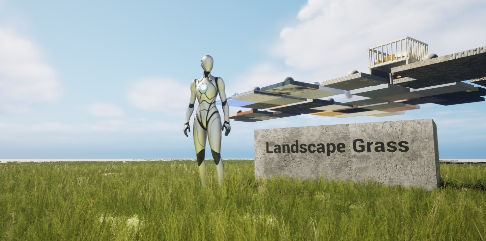
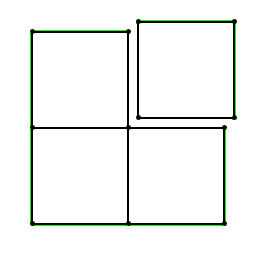
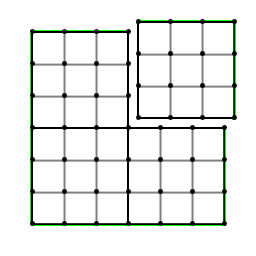
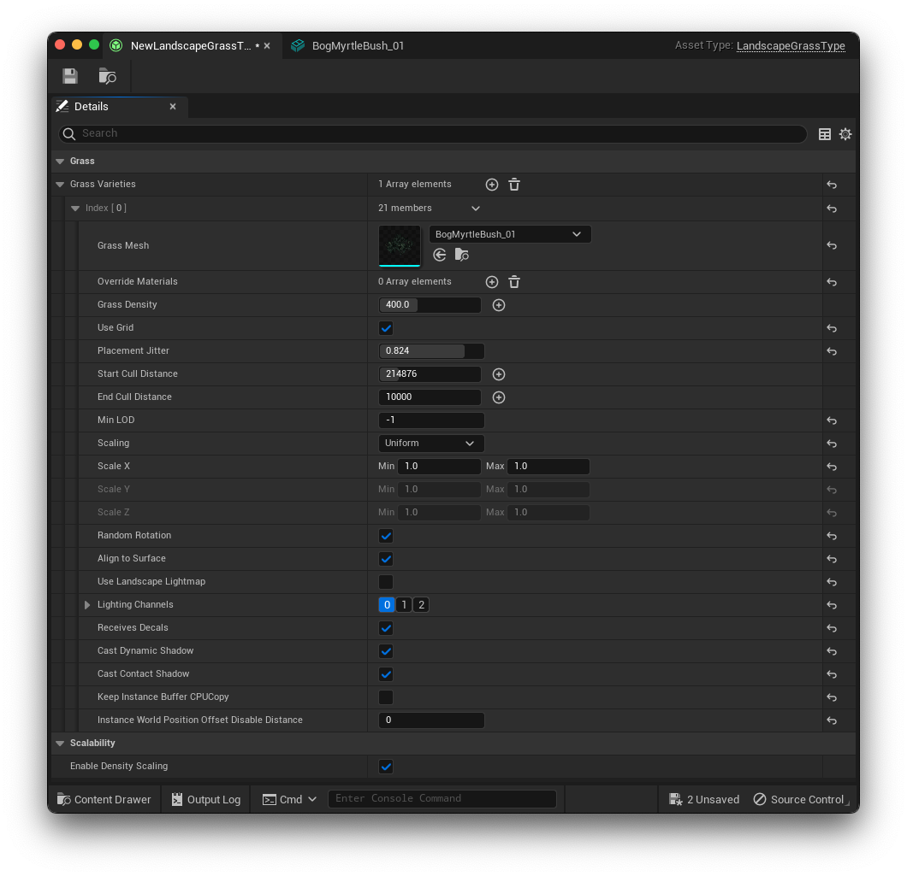
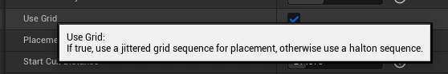

_本文试图对 Unreal Engine 4.27 / 5 中的 Landscape Grass （景观/地形草地） 系统的种草部分原理进行分析梳理。受限于笔者水平，文中内容可能存在一定谬误，请同时参考相关资料和源代码以获取更全面和准确的信息。_



如何使用 Landscape Grass? 详见官方快速上手指南 [Grass Quick Start](https://docs.unrealengine.com/5.2/en-US/grass-quick-start-in-unreal-engine/)

## Gameplay 架构梳理

因为 Landscape 基于 UE 的 Subsystem 架构，提前先熟悉相关的继承关系和生命周期对源码阅读帮助较大。

> 推荐阅读大钊的 [《InsideUE4》GamePlay 架构（十一）Subsystems](https://zhuanlan.zhihu.com/p/158717151)

ULandscapeSubsystem 继承关系 [^ULandscapeSubsystem]：

[^ULandscapeSubsystem]: [ULandscapeSubsystem | Unreal Engine Documentation](https://docs.unrealengine.com/5.2/en-US/API/Runtime/Landscape/ULandscapeSubsystem/)

```text /ULandscapeSubsystem/
- UObjectBase
  - UObjectBaseUtility
    - UObject
      - USubsystem
        - UWorldSubsystem
          - UTickableWorldSubsystem
            - ULandscapeSubsystem
```

Landscape Subsystem 是一个 Tickable World Subsystem, 场景中 Landscape Actor 的继承关系 [^ALandscape]：

```text /ALandscape/
- UObjectBase
  - UObjectBaseUtility
    - UObject
      - AActor
        - APartitionActor
          - ALandscapeProxy
            - ALandscape
```

[^ALandscape]: [ALandscape | Unreal Engine Documentation](https://docs.unrealengine.com/5.1/en-US/API/Runtime/Landscape/ALandscape/)

ALandscape 继承自 ALandscapeProxy，

## Landscape 地形基础

UE Landscape 设计框架的基础，参见官方文档 [Landscape Technical Guide](https://docs.unrealengine.com/5.2/en-US/landscape-technical-guide-in-unreal-engine/)， 此处做一个简单梳理。示意图来自官方文档。

### Landscape Component

对于 Landscape 框架来讲，Landscape Component 作为处理的最小粒度和渲染的基本单元。在创建 Landscape 伊始，所有的 Landscape Component 都是方形且同等大小。



### Component Section (Subsection)

Landscape Component 承载 Component Section，对于一个 Component 引擎只提供 1x1 或者 2x2 Section Per Component 的选项。

Component Subsection 主要用于地形 LOD 计算，用于提高地形分辨率和性能。通常来说一个 Section 会产生一个 Drawcall，但由于摄像机距离，有可能会导致多个 Section 合并成一个 Drawcall （1x1 section per component 或者 2x2 section per component 合并成一个 drawcall）。



## Foliage in UE5

正式进入 Landscape Grass 之前，我们先了解一下在 UE5 里面制作植被的几种方式，以及为什么我们选择 Landscape Grass 作为大型植被渲染方案。在 Content Browser 中右键，选择 Foliage 可以看到：


我们可以将这三种 Foliage 分为以下两类：

-   [Foliage Mode](https://docs.unrealengine.com/5.2/en-US/foliage-mode-in-unreal-engine/)
    -   Static Mesh Foliage
    -   Actor Foliage
-   [Landscape Grass](https://docs.unrealengine.com/5.2/en-US/grass-quick-start-in-unreal-engine/)

对于 Foliage Mode 我们有如下总结：

| **Type**                | **Description**[^foliagemode]                                                                                                          | Performance                                                                |
| :---------------------- | :------------------------------------------------------------------------------------------------------------------------------------- | -------------------------------------------------------------------------- |
| **Actor Foliage**       | Foliage type that places Blueprint or Native Actor instances in the scene. **High densities of foliage can cause performance issues.** | The cost of painting this foliage is the same as adding actors in a scene. |
| **Static Mesh Foliage** | Foliage type that uses mesh instancing. This type is best for non-destructive foliage.                                                 | Use **mesh instancing**, optimal for non-interactive foliage.              |

[^foliagemode]: [Foliage Mode in Unreal Engine | Unreal Engine 5.2 Documentation](https://docs.unrealengine.com/5.2/en-US/foliage-mode-in-unreal-engine)

Actor Foliage 和 Static Mesh Foliage 的差别在于，前者是无异于在场景中新增一个 Actor，后者则是用了实例化技术 (Mesh Instancing) 批量绘制植被，原生引擎中的 Static Mesh Foliage 通常是不可交互的，可以通过 [Foliage Tool](https://docs.unrealengine.com/5.2/en-US/foliage-mode-in-unreal-engine/) 手动绘制和 [Procedural Foliage Tool](https://docs.unrealengine.com/5.1/en-US/procedural-foliage-tool-in-unreal-engine/) 程序化生成。而 Landscape Grass 则对于大范围的景观植被制作提供了较好的流程和性能，通过流式加载 (level streaming 的形式动态加载) **Hierarchical Instanced Static Mesh (HISM)** 到场景里（与 InstancedFoliage 相同），不能在制作过程中手动确定每一个 instance 的位置。虽然 Landscape Grass 名字中带 Grass，但是实际上可以种植任意想要的植被 mesh.

## 种草流程图

## 开荒前准备

Landscape Subsystem 在 Tick 时会决定是否需要 TickGrass: `ShouldTickGrass()`

```cpp filename="LandscapeSubsystem.cpp" {17}
void ULandscapeSubsystem::Tick(float DeltaTime)
{
	...
	Super::Tick(DeltaTime);

	UWorld* World = GetWorld();
	// update cameras
	...
	int32 InOutNumComponentsCreated = 0;
	for (TWeakObjectPtr<ALandscapeProxy> ProxyPtr : Proxies)
	{
		if (ALandscapeProxy* Proxy = ProxyPtr.Get())
		{
			...
			if (Cameras && Proxy->ShouldTickGrass())
			{
				Proxy->TickGrass(*Cameras, InOutNumComponentsCreated);
			}

			Proxy->UpdateRenderingMethod(); // UE5: NaniteLandscape stuff
		}
	}
	...
}
```

当开启了地形草的情况下，主要是判断是否超出了一定的时间间隔，防止每一帧都更新草地带来没必要的开销。这个间隔在 Editor 中恒定为 1，也就是每一帧都会更新。

```cpp filename="LandscapeProxy.h" /UpdateInterval/
/* Per-frame call to update dynamic grass placement and render grassmaps */
FORCEINLINE bool ShouldTickGrass() const
{
	// At runtime if we don't have grass we will never have any so avoid ticking it
	// In editor we might have a material that didn't have grass and now does so we can't rely on bHasLandscapeGrass.
	if (!GIsEditor && !bHasLandscapeGrass)
	{
		return false;
	}

	const int32 UpdateInterval = GetGrassUpdateInterval();
	if (UpdateInterval > 1)
	{
		if ((GFrameNumber + FrameOffsetForTickInterval) % uint32(UpdateInterval))
		{
			return false;
		}
	}

	return true;
}
```

在非编辑器下的 Game 模式，可以通过 Console Variable `grass.TickInterval` 来设置更新间隔，其数值会被 clamp 在 1 到 60 之间。

> 《堡垒之夜》 的 TickInterval 是 10 [^fortnite_grass_tickinterval]

[^fortnite_grass_tickinterval]: [Adjusting How Fast Landscape Grass Appears](https://forums.unrealengine.com/docs?topic=506003)

```cpp filename="LandscapeGrass.cpp"{6}
static void GrassCVarSinkFunction()
{
	...
	if (FApp::IsGame())
	{
		ALandscapeProxy::SetGrassUpdateInterval(FMath::Clamp<int32>(GGrassTickInterval, 1, 60));
	}
  ...
}
```

准备开始 Tick 种草了，做了一些性能埋点和编辑器的逻辑判断，之后通过 `UpdateGrass()` 进入草地更新流程。

```cpp filename="LandscapeGrass.cpp" {12}
//
// ALandscapeProxy grass-related functions
//

void ALandscapeProxy::TickGrass(const TArray<FVector>& Cameras, int32& InOutNumCompsCreated)
{
	TRACE_CPUPROFILER_EVENT_SCOPE(ALandscapeProxy::TickGrass);
#if WITH_EDITORONLY_DATA
	...
#endif

	UpdateGrass(Cameras, InOutNumCompsCreated);
}
```

## 草的数据类型 GrassData and GrassType



前面提到，种植的不一定是“草”，可以是任意想要的植被 mesh，因此我们需要了解种植的数据是什么。

GrassData 主要是渲染数据的关系映射，Landscape Grass 在恰当的时机会 streaming 具体的植被 HISM 到场景，因此需要知道加载的植被数据 (GrassType) 和植被的空间分布，草的位置分布由一张 weightmap 来决定，还有一张 heightmap 用于确定草的空间位置，防止植被浮空或者入地。

GrassType 是一个大的植被容器，其中可以装有不同类型的植被 mesh, 称作 GrassVariety, 用于避免植被的千篇一律。可以看到上图中，GrassType 内含一个 GrassVarieties Array，可以存放多个 GrassVariety，而具体控制种草的信息则由具体的 GrassVariety 去设定，譬如放置密度 (Grass Density)、随机放置算法 (Grid / Halton)、实例化裁剪距离 (Cull Distance) 等。

GrassData 离线存在于 LandscapeComponent 中，只有在 Editor 里触发 `EditorBuildGrassMaps` 时会更新这个数据。

```cpp filename="LandscapeComponent.h"
/** Grass data for generation **/
TSharedRef<FLandscapeComponentGrassData, ESPMode::ThreadSafe> GrassData;

struct FLandscapeComponentGrassData
{
	...
	// UE4 的实现:
	// TArray<uint16> HeightData;
	// TMap<ULandscapeGrassType*, TArray<uint8>> WeightData;
	// UE5:
	// Serialized in one block to prevent Slack waste
	TMap<ULandscapeGrassType*, int32> WeightOffsets;
	TArray<uint8> HeightWeightData;
	...
}
```

UE5 中优化了 Grass weight/height 的存储 layout ，用一个连续的 array 加上 offset 来获取：

```cpp filename="LandscapeGrass.h"
TArrayView<uint8> FLandscapeComponentGrassData::GetWeightData(const ULandscapeGrassType* GrassType)
{
	if (!HeightWeightData.IsEmpty())
	{
		if (int32* OffsetPtr = WeightOffsets.Find(GrassType))
		{
			int32 Offset = *OffsetPtr;
			check(Offset + NumElements <= HeightWeightData.Num());
			check(NumElements);
			return MakeArrayView<uint8>(&HeightWeightData[Offset], NumElements);
		}
	}

	return TArrayView<uint8>();
}

TArrayView<uint16> FLandscapeComponentGrassData::GetHeightData()
{
	if (HeightWeightData.IsEmpty())
	{
		return TArrayView<uint16>();
	}

	check(NumElements <= HeightWeightData.Num());
	return MakeArrayView<uint16>((uint16*)&HeightWeightData[0], NumElements);
}
```

至于是如何构建这个 GrassData 的 weight/height, 可以翻看源码的这个函数，此处不继续展开：

```cpp
void FLandscapeComponentGrassData::InitializeFrom(const TArray<uint16>& HeightData, const TMap<ULandscapeGrassType*, TArray<uint8>>& WeightData)
```

LandscapeGrass 种的草和 Foliage Tool (Static Mesh Foliage / InstancedFoliage) 种的都是 HISM Component，这一部分在之后的流程会提到。

## 草的更新阶段

TickGrass 时召唤 `UpdateGrass()`.

真实开始种草前的准备工作，先获取到当前 LandscapeMaterial 输出的：

| Type   | Name                        | Description                                                                         |
| ------ | --------------------------- | ----------------------------------------------------------------------------------- |
| TArray | **Landscape Grass Types**   | 地形材质 (Landscape Material) 可以接受多种 Grass Type                               |
| float  | **GrassMaxDiscardDistance** | 舍弃最远剔除距离外草，通过遍历所有 GrassType→GrasVariety 找到最大的 EndCullDistance |

### 更新逻辑一览

`UpdateGrass()` 的大致处理次序为：

1. _Landscape Component Culling_: 遍历所有 Landscape Component，进行基于相机距离的 Culling，输出 `SortedLandscapeComponents`

2. _Grass Variety Subsection Culling_: 遍历 `SortedLandscapeComponents` 下的 Grass Variety（顺序是先遍历所有的 Landscape Grass Types -> Grass Varieties） ，进行基于相机距离的 **Grass Variety Subsection** Culling

3. 为将要被生成的草引入数据结构 `FCachedLandscapeFoliage::FGrassComp` ，在 editor 里如果还没有 GrassData，在这里会触发一次生成。

4. 创建 `HierarchicalInstancedStaticMeshComponent` (HISM Comp)，填入数据，一种 Grass Variety 为一个 HISM Comp （与 InstancedFoliage 处理方式相同）。

    1. 如果有 LOD，做出相对应的处理（LightMap, ShadowMap, ResourceCluster）。
    2. 写入 Instance Culling 数据（用于 visibility culling）

5. 创建 AyncGrassBuilder，推入到 AsyncTask 队列并 `StartBackgroundTask()`

    > 异步任务进行进行种草渲染，生成 Instance 等

6. 注册 HISM Comp 到世界中

7. 清理工作

### Landscape Component Culling

Landscape Component Culling （判断某块 Landscape Component 上是否需要处理草，遍历当前 Landscape 所有的 LandscapeComponent）

根据 Camera 到 LandscapeComponent 的 Bounding Box 的距离判断，如果在范围外则放弃这个 Component。

```cpp filename="LandscapeGrass.cpp" {12-15}
for (ULandscapeComponent* Component : LandscapeComponents)
{
	// skip if we have no data and no way to generate it
	...
	FBoxSphereBounds WorldBounds = Component->CalcBounds(Component->GetComponentTransform());
	float MinSqrDistanceToComponent = Cameras.Num() ? MAX_flt : 0.0f;
	for (const FVector& CameraPos : Cameras)
	{
		MinSqrDistanceToComponent = FMath::Min<float>(MinSqrDistanceToComponent, WorldBounds.ComputeSquaredDistanceFromBoxToPoint(CameraPos));
	}

	if (MinSqrDistanceToComponent > GrassMaxSquareDiscardDistance)
	{
		continue;
	}
  ...
}
```

1. 得到需要处理的 SortedLandscapeComponents，遍历。
2. 该 Component 的 Bounding Box 和 GGrassExclusionBoxes 做相交检测，如果相交，把 ExclusionBox 的 FBox 添加到 Component 中的 ActiveExcludedBoxes，稍后使用。

### Grass Variety Subsection Culling

针对剔除后的 landscape component，进一步优化草的生成范围，引入 Grass Variety Subsection 的概念。注意，这里的 subsection **并非 Landscape Component SubSection**，与 Landscape 的渲染无关。

该步骤的粒度是针对于某一种 Grass Variety 的 culling，通过相机距离与处理后的该 Grass Variety 的 End Cull Distance 做比较，确定该 Grass Variety 是否需要被生成，如果不需要则直接丢弃，跳出当前循环。

如果这个 Variety 有 Mesh，有 Density，EndCullDistance > 0，三者同时满足才会开始处理，否则会直接跳过这个 Variety.

subsection 的数量被 clamp 在 1 到 16 之间，每一个 subsection 都是一个正方形。

```cpp
if (ForSubsectionMath.bHaveValidData && ForSubsectionMath.SqrtMaxInstances > 0)
{
	SqrtSubsections = FMath::Clamp<int32>(FMath::CeilToInt (float (ForSubsectionMath.SqrtMaxInstances) / FMath::Sqrt ((float) MaxInstancesPerComponent)), 1, 16);
	// ^ MaxInstancesPerComponent = max (1024, grass.MaxInstancesPerComponent)
}
int32 MaxInstancesSub = FMath::Square (ForSubsectionMath.SqrtMaxInstances/ SqrtSubsections);
```

> CVar: `grass.MaxInstancesPerComponent` 设置 MaxInstancesPerComponent，默认值是 65536，最小值是 1024.

`MaxInstancesSub` 为单个 subsection 上的 instance 最大数量，用于 Halton 随机放置，如果是 Jittered Grid 方法则不需要这个数值。

以上 landscape component 和 variety subsection 的 culling 都完成了，此时没有任何 grass 的具体数据载入到内存中，也没有任何 visibility culling.

### Exclusion Boxes Intersection Test

注意到 LandscapeProxy 中提供了一个 ExclusionBox 接口，猜测是可以用于防止草在一些地方被生成（譬如房屋）。在前面两步中的 distance culling 中都有相对应的 intersection 检测。搜索引擎代码后没有发现这些接口被直接调用的案例。

```cpp
static TMap<FWeakObjectPtr, FBox> GGrassExclusionBoxes;

void ALandscapeProxy::AddExclusionBox (FWeakObjectPtr Owner, const FBox& BoxToRemove)
{
	GGrassExclusionBoxes.Add (Owner, BoxToRemove);
	GGrassExclusionChangeTag++;
}
void ALandscapeProxy::RemoveExclusionBox (FWeakObjectPtr Owner)
{
	GGrassExclusionBoxes.Remove (Owner);
	GGrassExclusionChangeTag++;
}
void ALandscapeProxy::RemoveAllExclusionBoxes ()
{
	if (GGrassExclusionBoxes.Num ())
	{
		GGrassExclusionBoxes.Empty ();
		GGrassExclusionChangeTag++;
	}
}
```

### GrassComp

到这里，culling 的部分都结束了，准备开始处理草的渲染。引入新的类 `FCachedLandscapeFoliage` 和数据结构 `FCachedLandscapeFoliage::FGrassComp`

1. 结构粒度： `FCachedLandscapeFoliage::FGrassComp` 存放单种 Grass Variety 的 **Foliage HISM Comp** 、其所在的 landscape component、grass variety subsection 坐标信息，以及这个 Grass Variety 的父级 Grass Type
2. 结构作用：用于待会构建这个 Grass Variety 的 Foliage HISM Comp，并存放了现存的 Foliage HISM Comp.

需要注意，种草真正种的是 HISM Comp，如类名所示这个只是在 LandscapeGrass 中作 Cache 用途。

分析源码得知，UpdateGrass 每 Tick 被调用一次，默认 per frame 创建一个 GrassComp，但可通过如下 CVar 修改

> CVar: `grass.MaxCreatePerFrame` 设置每一帧最多创建的 HISM component 数量，默认为 1，这个值越高种草也就越快，性能要求也就越高。

```cpp
static int32 GGrassMaxCreatePerFrame = 1;
static FAutoConsoleVariableRef CVarGrassMaxCreatePerFrame (
	TEXT ("grass.MaxCreatePerFrame"),
	GGrassMaxCreatePerFrame,
	TEXT ("Maximum number of Grass components to create per frame"));
```

创建 GrassComp 之后，还没有开始异步任务创建 HISM Comp，此时会判断当前的异步任务池中的任务数量，如果已经达到 `MaxAsyncTasks`，则跳出当前循环（没生成的草可能会等到下一个 grass tick）

> CVar: `grass.MaxAsyncTasks` 用于控制一次 TickGrass 中最大异步任务数

创建 HISM Comp 的关键代码：

```cpp
for (auto& GrassVariety : GrassType->GrassVarieties)
{
	if (GrassVariety.GrassMesh && GrassVariety.GrassDensity.GetValue() > 0.0f && EndCullDistance > 0)
	{
		for (int32 SubX = 0; SubX < SqrtSubsections; SubX++)
		{
			for (int32 SubY = 0; SubY < SqrtSubsections; SubY++)
			{
				// UE4: UHierarchicalInstancedStaticMeshComponent* HierarchicalInstancedStaticMeshComponent;
				// UE5 用了继承 HISM Comp 的新类 UGrassInstancedStaticMeshComponent
				UGrassInstancedStaticMeshComponent* GrassInstancedStaticMeshComponent;
				{
					QUICK_SCOPE_CYCLE_COUNTER(STAT_GrassCreateComp);
					GrassInstancedStaticMeshComponent = NewObject<UGrassInstancedStaticMeshComponent>(this, NAME_None, RF_Transient);
				}
				NewComp.Foliage = GrassInstancedStaticMeshComponent;
				FoliageCache.CachedGrassComps.Add(NewComp);
				...
```

处理 HISM Comp 相关数据，譬如 mesh，culling distance（渲染），LOD 相关数据（如果有 LOD）等等。部分代码如下：

```cpp
const FMeshMapBuildData* MeshMapBuildData = Component->GetMeshMapBuildData();

if (GrassVariety.bUseLandscapeLightmap
	&& GrassVariety.GrassMesh->GetNumLODs() > 0
	&& MeshMapBuildData
	&& MeshMapBuildData->LightMap)
{
	GrassInstancedStaticMeshComponent->SetLODDataCount(GrassVariety.GrassMesh->GetNumLODs(), GrassVariety.GrassMesh->GetNumLODs());

	FLightMapRef GrassLightMap = new FLandscapeGrassLightMap(*MeshMapBuildData->LightMap->GetLightMap2D());
	FShadowMapRef GrassShadowMap = MeshMapBuildData->ShadowMap ? new FLandscapeGrassShadowMap(*MeshMapBuildData->ShadowMap->GetShadowMap2D()) : nullptr;

	for (auto& LOD : GrassInstancedStaticMeshComponent->LODData)
	{
		// This trasient OverrideMapBuildData will be cleaned up by UMapBuildDataRegistry::CleanupTransientOverrideMapBuildData() if the underlying MeshMapBuildData is gone
		LOD.OverrideMapBuildData = MakeUnique<FMeshMapBuildData>();
		LOD.OverrideMapBuildData->LightMap = GrassLightMap;
		LOD.OverrideMapBuildData->ShadowMap = GrassShadowMap;
		LOD.OverrideMapBuildData->ResourceCluster = MeshMapBuildData->ResourceCluster;
	}
}
```

之后就是准备开始异步任务进行种草。

## 异步任务种草

在 `UpdateGrass()` 内，程序创建了一个 `FAsyncGrassBuilder`，Builder 就是真实种草任务的最小单位。

```cpp filename="LandscapeGrass.cpp" {2,7-11}
...
	Builder = new FAsyncGrassBuilder(this, Component, GrassType, GrassVariety, FeatureLevel, GrassInstancedStaticMeshComponent, SqrtSubsections, SubX, SubY, HaltonIndexForSub, NewComp.ExcludedBoxes);
}

if (Builder->bHaveValidData)
{
	FAsyncTask<FAsyncGrassTask>* Task = new FAsyncTask<FAsyncGrassTask>(Builder, NewComp.Key, GrassInstancedStaticMeshComponent);

	Task->StartBackgroundTask();

	AsyncFoliageTasks.Add(Task);
}
else
{
	delete Builder;
}
{
	QUICK_SCOPE_CYCLE_COUNTER(STAT_GrassRegisterComp);

	GrassInstancedStaticMeshComponent->RegisterComponent();
}
...
```

因为 HISM Comp 是 GPU Instancing 的做法，可以想到一个 HISM Comp 中存放的一定是相同的 mesh，也就是同种 Grass Variety，因此 Grass Variety 作为生成批量种草的最小单位。

### Grass Variety 随机放置算法



Grass Variety 的随机放置有两种算法：

1. **Jittered Grid Sequence**: Jitter 值越大看起来越随机，越小越平均到 grid 中（Variety 设置中 Use Grid 是 true 则是该算法，false 则是 Halton 方法）

2. **[Halton Sequence](https://web.maths.unsw.edu.au/~josefdick/MCQMC_Proceedings/MCQMC_Proceedings_2012_Preprints/100_Keller_tutorial.pdf)**: 低 discrepancy 的伪随机序列，生成较均匀又随机分布的草

### Build Grass

`FAsyncGrassBuilder::Build()` 产出：InstanceBuffer、ClusterTree

TaskGraph - AnyThread

```cpp
UHierarchicalInstancedStaticMeshComponent::BuildTreeAnyThread(InstanceTransforms, InstanceCustomDataDummy, 0, MeshBox, ClusterTree, SortedInstances, InstanceReorderTable, OutOcclusionLayerNum, DesiredInstancesPerLeaf, false);
```

### Destroy

判断 HISM Comp 是否还在使用，清理无用的 HISM Comp `Component->DestroyComponent();`

## 总结

-   总体上，LandscapeGrass 会在线计算要载入内存的植被数量（范围），根据 Grass Variety 中的 EndCullDistance 等参数异步载入 / 卸载到内存。
-   距离剔除 (Distance Culling) 的最小粒度是 Grass Variety Subsection，对于没有草或者距离外的 Grass Variety Subsection，会直接被丢弃，也不会有 Grass 在上面生成。
-   LandscapeGrass 细化 Landscape Component 的数量（SortedLandscapeComponent），进而细化 Grass Variety Subsection 数量，来控制生成 Instances 的数量。
-   一个 Grass Variety Subsection 上的一个 Grass Variety 对应一个 HISM Comp，也就是说场景内同个 Grass Variety 可能会有不同的 HISM Comp （存在多个 Grass Variety Subsection），不存在一对一关系；但在单个 Grass Variety Subsection 上的 Grass Variety 只会对应生存一个 HISM Comp.
-   可以设置 ExclusionBoxes 来屏蔽指定区域生成 HISM Comp.
-   TickInterval 可以根据情况调高以降低性能开销。

## 参见

1. [UE4 中的植被工具](https://zhuanlan.zhihu.com/p/389430858)
2. [LearnOpenGL - Instancing](https://learnopengl.com/Advanced-OpenGL/Instancing)
3. [UE4 材质系统](https://papalqi.cn/ue4材质系统/)
4. [Halton Sequence](https://web.maths.unsw.edu.au/~josefdick/MCQMC_Proceedings/MCQMC_Proceedings_2012_Preprints/100_Keller_tutorial.pdf)

## Reference
