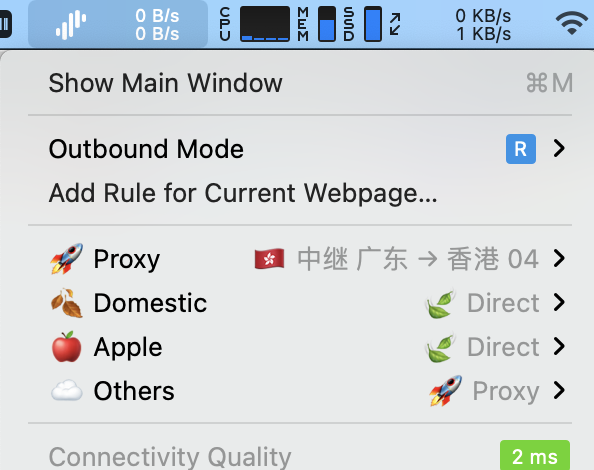

> This blog might be outdated. Please refer to the official documentation for the latest information.

## Introduction

Nowadays, developer tend to use professional networking toolbox such as **Surge** to test network stability and debug their software in the different networking environments. However, this can lead to a convoluted and intricate subscription setup, making it arduous to debug intricate networking issues. Fortunately, **Surgio** offers a simple solution to this problem, enabling you to easily manage your services. In this article, we'll provide a comprehensive introduction to Surgio, explaining how to configure it concisely and in an easy-to-understand manner. Note that this article is quite lengthy, and if you're an experienced programmer or engineer, you may want to refer to the [official documentation](https://surgio.js.org/) for a quick start.

The primary focus of this article is on configuring Surgio to optimize its performance. We'll cover tips on using **external proxies (such as SSR and V2ray)** and **rule templates**. While you can obtain the Surge profile from airport[^1], we'll be concentrating on customizing Surgio's configuration and providing techniques for using Surge. Additionally, we'll introduce external proxy SSR later in the article and demonstrate how to configure it easily using Surgio.

[^1]: Airport means your servers’ provider that will be mentioned throughout the rest of this article.

Surgio has two **main functions**: Firstly, it parses subscription configuration addresses from various airports or a list of nodes that you maintain yourself. Secondly, it generates the required rules based on customizable templates that you can modify as needed.

[^2]: From the official website of Surgio: [link](https://surgio.js.org/guide/#%E5%AE%83%E6%98%AF%E5%A6%82%E4%BD%95%E5%B7%A5%E4%BD%9C%E7%9A%84)


## Requirements

Assuming that you have already purchased or used Surge as your network diagnostic utility, I assume that you have some basic understanding of network and web programming. Therefore, we will skip some simple procedures later.

Requirements:

-   Strong hands-on ability
-   Knowledge of Javascript programming (at least for reading and modifying purposes)
-   Familiarity with using modern editors
-   Basic knowledge of networking (understanding how a simple web server works)
-   Basic knowledge of Git and Github

If you are lacking of these abilities, you may not want to use Surgio, or just STFW.

## Get started

### Composition of Surgio

The workflow of Surgio is composed of three main parts. To understand the theory of Surgio, it's important to understand the relationship between these three components and the following practices.

#### Provider

The provider is the source of server nodes, which can be a subscription address or a configuration of a group of nodes.

#### Template

A template is a set of rules that Surgio will use to render files according to the specified configuration.

#### Artifact

Artifacts are generated by Surgio based on configurations consisting of a template and a provider.

[^3]: From the official documentation: [link](https://surgio.js.org/guide/getting-started.html#%E6%9C%AF%E8%AF%AD%E8%A7%A3%E9%87%8A)

### Install Node

Install the latest version of Node.js (LTS) from the [official website](https://nodejs.org/en/download/). If you already have Node installed, skip this step.

To check if Node is working correctly, run the following command in your terminal:

```shell
$ node -v
v12.18.4 # you may have a different version
```

If any errors come up, use a modern editor to modify the file. **If you are a Windows user, avoid using the default text editor.**

### Install Surgio

Initialize Surgio with the name _my-rule-store_ (you can use any name you prefer):

```shell
npm init surgio-store my-rule-store
```

Directory of the project would look like this after install:

```
.
├── node_modules
├── package-lock.json
├── package.json
├── provider
├── surgio.conf.js
└── template
```

### Test local generator

You should already have some policy templates after install. To generate a policy group configuration, run this command in the directory.

```shell
npx surgio generate
```

The config files will be added to directory `dist` in the root of project, if the directory doesn't exist, it will be created. These configurations are generated by the rules you designated in `surgio.conf.js`. You can always generate artifacts by inputting the command on your computer according to your config of Surgio.

## Rules, templates

To make the most of Surgio, it's important to configure it properly using templates. Let's explore how to do that.

Surgio offers a range of well-established templates for various tools, but for this article, we'll focus on configuring it for Surge. If you take a quick look at the `template/surge_v3.tpl` file, you'll notice that the language is quite easy to understand. Additionally, Surgio provides code snippets that can be applied to other templates, which greatly enhances reusability.

Tree of template directory would be like:

```
.
├── README.md
├── clash.tpl
├── quantumult.tpl
├── quantumult_rules.tpl
├── quantumultx.tpl
├── quantumultx_rules.tpl
├── quantumultx_subscribe.tpl
├── shadowsocks_subscribe.tpl
├── snippet
│   ├── apple_rules.tpl
│   ├── blocked_rules.tpl
│   ├── direct_and_domestic_rules.tpl
│   ├── direct_rules.tpl
│   ├── new_apple_rules.tpl
│   ├── nowe_rules.tpl
│   ├── proxy_rules.tpl
│   ├── us_rules.tpl
│   └── youtube_rules.tpl
├── surge_simple.tpl
├── surge_v3.tpl
└── surge_v4.tpl
```

### Using Ready-Made Templates

If you are new to creating templates or just looking for some inspiration, you can find modified templates in [this repository](https://github.com/jukrb0x/surgio-templates) to use as your starting point. Additionally, there are numerous [Surge rules](https://github.com/search?q=surge+rules) available on Github that you can modify and turn into Surgio templates yourself.



In some cases, your airport may not provide a Surge profile because SSR and V2Ray are not natively supported in Surge. In this situation, you will need to generate your own profile, which can be done by simply using the SSR or V2Ray subscription link. This is also where External Proxies come in handy.

### External proxy (ssr, v2ray)

Surge Mac Build 622[^4] introduced a new feature called External Proxy[^5], allowing Surgio to work with other proxy services such as shadowsocksr (ssr). Here's how to make it work on Surgio:

[^4]: Surge Mac New Features: External Proxy Provider, Yachen Liu, Jul 13 2018, [link](https://blankwonder.medium.com/surge-mac-new-features-external-proxy-provider-375e0e9ea660)
[^5]: _4.2.2.2 external type (Surge Mac only)_, [Official Guidance: Understanding Surge](https://manual.nssurge.com/book/understanding-surge/en/#external-type-surge-mac-only)

**Note:** This guide only covers shadowsocksr (ssr). If you're a v2ray user, please refer to [this link](https://surgio.js.org/guide/advance/surge-advance.html#修改-surgio-配置) as the procedure is the same.

To get started, you'll need to install a shadowsocksr service named shadowsocksr-libev. You can download `ssr-local` to `/usr/local/bin/` and make it execuatable with the following command:

```shell
curl -L https://github.com/tindy2013/shadowsocks-static-binaries/raw/master/shadowsocksr-libev/macos/ssr-local -o /usr/local/bin/ssr-local && chmod +x /usr/local/bin/ssr-local
```

Do it with your own caution!

### Configure for Sugrio

To generate artifacts accordingly, **add** the following fields to `surgio.conf.js`.

```js showLineNumbers {4-5} filename="surgio.conf.js"
module.exports = {
    // ...
    binPath: {
        shadowsocksr: '/usr/local/bin/ssr-local', // If you are a SSR user
        v2ray: '/usr/local/bin/v2ray' // If you are a V2ray user
    },
    surgeConfig: {
        resolveHostname: true
    }
};
```

And change the artifacts, for example:

```js filename="surgio.conf.js"
artifacts: [
    // ...
    {
        name: 'Surge_example_artifact.conf',
        template: 'surge_v4',
        provider: 'feynman_diagram'
    }
];
```

## Cloud Deployment

> **Latest News:** Vercel has restricted the deployment of Surgio regarding the fair usage policy that Proxy is not allowed to deploy (even the proxy configuration generator like Surgio). **Deploy Surgio on Vercel could result in your account being locked by Vercel.**

> You still can use Heroku to deploy Surgio, check out [this official demo](https://github.com/surgioproject/heroku_demo).

In this section, we'll demonstrate how to run Surgio on a serverless service called Vercel. If you're only planning to run Surgio on your computer, you can skip this chapter. However, if you plan to run Surgio on a server in the future, please read this section carefully. It contains important information that you need to be aware of. 🚨

### Gateway Setup

Before setting up the gateway, ensure that it can run as an HTTP server. To do this, you need to install a gateway for your project. However, it's important to note that the gateway isn't added by default in Surgio.

To install the gateway, use a proper Node Package Manager (NPM).

```json filename="package.json" showLineNumbers {12}
{
    "name": "my-rule-store",
    "version": "0.1.0",
    "private": true,
    "scripts": {
        "update": "surgio generate && surgio upload"
    },
    "engines": {
        "node": "^12"
    },
    "dependencies": {
        "@surgio/gateway": "^1.2.1",
        "surgio": "^2.7.3"
    }
}
```

> The gateway will be used for communication authorization between your local machine and server when you run Surgio on Vercel. If you plan to stick to the local environment, then you won't need to add the gateway or install it using npm. That's perfectly fine.

However, it's important to note that the version of Node environment should be higher than 12. Also, ensure that you're using the latest version of Surgio (v2.7.3) and Surgio Gateway. If there are any updates, please follow the instructions mentioned in the [official documentation](https://surgio.js.org/) before updating this article.

### Authorization Setup

To ensure that your servers are secure and not compromised, it's important to set up authorization for the gateway. This will restrict access to the gateway to only authorized users.

To set up authorization, follow the instructions mentioned in the official documentation of Surgio. This will involve setting up an environment variable with a secret key and adding it to your gateway configuration.

It's crucial to keep the secret key secure and not share it with anyone who doesn't have authorized access to your servers.

```js filename="surgio.conf.js" /Password/
// Auth
  gateway: {
    auth: true,
    accessToken: 'Password',
  },
```

You can configure the `assessToken` as the password of your choice for authorization between your local machine and server. The `assessToken` will be used to authenticate and authorize access to the gateway.

To prevent your data from being compromised, it's essential to set up authorization for the gateway. I recommend configuring the `accessToken` as an environment variable and using it in your gateway configuration. It's bad practice to write the password explicitly in your source code even the repository is private only.

Make sure to choose a strong and secure password and keep it confidential. This will prevent unauthorized access to your servers and ensure the security of your servers.

### Vercel Configuration

To run Surgio on Vercel, you need to configure a file named `vercel.json` in the root directory of your project. If the file doesn't exist, create one.

Copy the configuration below and paste it in your `vercel.json` file:

```json
{
    "public": false,
    "builds": [
        {
            "src": "/gateway.js",
            "use": "@vercel/node",
            "config": {
                "includeFiles": ["provider/**", "template/**", "*.js", "*.json"]
            }
        }
    ],
    "routes": [
        {
            "src": "/(.*)",
            "dest": "/gateway.js"
        }
    ]
}
```

### Push to GitHub

Once you've completed the basic setup, try to push the project to a **private** GitHub repository. Make sure that the repository is private to comply with regulations.

### Link to Vercel

Vercel is an amazing serverless provider, although you may use other similar services such as Netlify. However, this tutorial is based on Vercel, so if you're using other services, make sure to carefully read the documentation and change the configurations as required.

To link your project to Vercel, simply import it from GitHub. You don't need to change any settings on Vercel. Once you've completed these steps, Vercel will automatically deploy your project every time you push a new commit.

Note that you need to change the `urlBase` field in `surgio.config.js` after linking to Vercel. This URL will be regarded as the prefix of subscription config, which ensures that Surge can sync profiles from the designated address.

### Login to Surgio

You can now access Surgio from the URL provided by Vercel. You'll be prompted to enter your authorization credentials. Once you're logged in, you can generate the artifact from the dashboard and import it to your Surge configuration.

## Epilogue

<span class="sr-only">
    The contents of this article are originally written by [@jukrb0x](./about) and first published
    in [this blog](/). This article is for the sole purpose of learning about and using the
    networking analysis tool Surge and open source software Surgio, and should not be used for any
    other purpose that is contrary to your local laws and regulations, this article is **LICENSED
    UNDER [CC BY-NC-SA 4.0](http://creativecommons.org/licenses/by-nc-sa/4.0/).** Please note [the
    url](https://wh0.is/p/surgio-tutorial-make-surge-easier) of this article for reproduction.
</span>

That’s the wrap, thanks for reading. 💃 🌓 🕺


