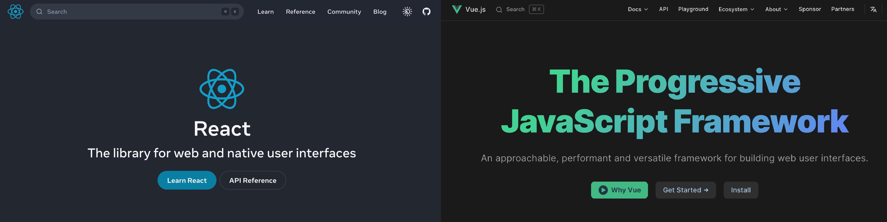
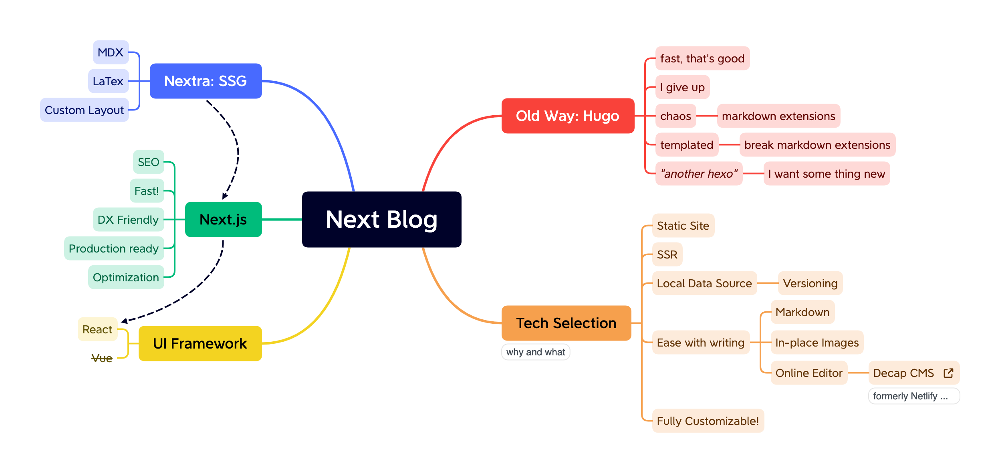
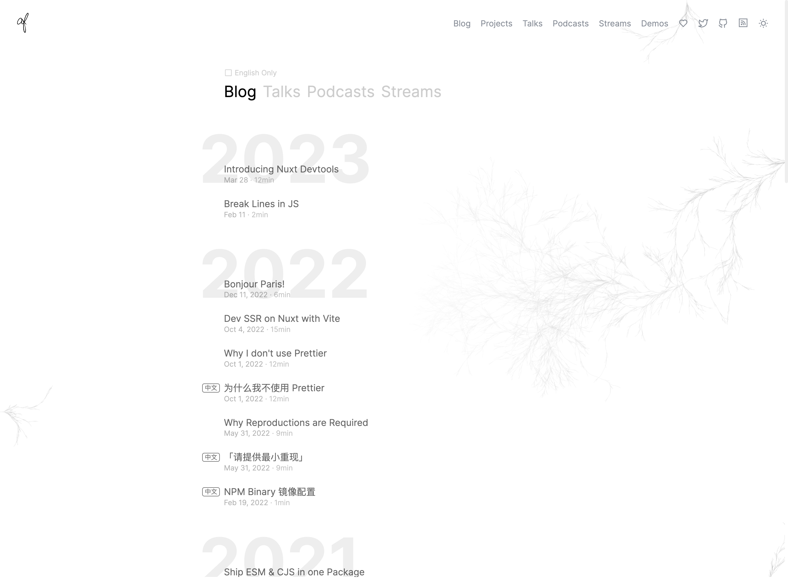

I have been blogging since 2017 when I was young. Over the years, I have used many blogging systems, some dynamic ones mostly written in PHP, such as WordPress and Typecho, and some static ones like Hexo and Hugo. The two approaches have their own pros and cons. Ultimately, I transitioned from dynamic blogging platforms to a fully static website.

I love exploring new things, and recently I have been delving into React, and [Next.js](https://nextjs.org/), a React framework dedicated to web development. I think it's the time to build a brand-new website based on it.

## The initiative

For the past six years, I've had an online blog that has remained largely neglected. Rather than actually blogging, I found myself endlessly tinkering with the system itself - switching between platforms and themes, tweaking servers and plugins. As I delved deeper into the world of web technologies, I started to care more about user interface, website accessibility, and performance. My latest iteration was built with [Hugo](https://gohugo.io/), though I hadn't actually updated the content since 2020.

Lately, it dawned on me that none of these technical optimizations mattered if I wasn't actually expressing myself. A blog, after all, should be an outlet to share your voice, not just a platform to endlessly experiment on. I realized it was time to get back to basics and build a space for recording my experiences, sharing insights from work and life, and simply writing with purpose again.

So I made the decision to start from scratch. Build a new blog, with a renewed vision - a place to discover and nurture my own voice. The technology powering it almost seems secondary now, but I still wanted to build something that was fast, accessible, and easy to maintain. This new blog represents a fresh start on a journey to rediscover myself. The blog I always meant to have, beyond any flash or fanfare, with writing at its heart.

## Dynamic vs. Static

I'm loving life with a static website now after switching from those dynamic ones like WordPress. Sure, those had their perks:

-   Easy to set up and use, just install on VPS and you are ready to go
-   Tons of plugins and themes with many free options
-   Supported by a huge community
-   Just write and publish

However, dynamic websites also came with some significant downsides:

-   Costly to maintain over time, with recurring VPS and domain fees
-   Potential security vulnerabilities required constant updates to fix
-   Backups and disaster recovery were complicated by the database-driven structure

After digging in some static site generators (SSG), I found that they are much more suitable for my needs:

-   Free to host on GitHub Pages, Vercel, Netlify, or any other static hosting service
-   No database means increased security and no backend to maintain
-   Full autonomy over my site and content, I do what I want
-   Easy to backup and restore using Git

## What I deprecated and Why

Hexo and Hugo are both excellent static site generators. Hexo suits blogs well, while Hugo is more versatile and faster than Hexo (Hugo allegedly the world's fastest SSG). Initially, I was content with Hugo. However, I found it difficult to customize themes and work within the constraints of its templates, I don't feel the full control of the website. I also became enamored with the idea of Frontend Engineering, and wanted to build a website with React.

### Why React and Next.js?



Ok, to be honest, I love Vue.js as well as React, Vue.js feels more intuitive and easier to learn, **Vue 3 is fantastic**. However, React is more widely used and has a larger community, and I'm keen to dive deeper into React (🤩 go to see their [latest doc here](https://react.dev/)). I also looked at VuePress, Gatsby, Astro, and Svelte, but Next.js is the most mature with the best documentation, whether you're just getting into web dev or you've been doing it for years. Next.js also provides many out-of-box optimizations, here are some ideas I love:

-   Next.js pre-renders pages ahead of requests (Server-side rendering, SSR) which proviedes fast and responsive blog site experience
-   Images optimization `next/image` and lazy loading components
-   Built-in Sass support and component-level styling
-   File-system based routing and intuitive URLs organization

### Looking for solutions

A great way to begin a new project is researching exisiting solutions - they may have already sovled issues you'll face. [Pliny](https://github.com/timlrx/pliny) is one option for a Next.js CMS, using Contentlayer for modeling. Check out [Spencer's blog](https://spencerwoo.com/) for inspiration.

Ultimately, I chose [Nextra](https://nextra.site/) - another reason I stuck with Next.js. It bridges Next.js and MDX (Markdown with React components). Many docs sites are built with it, such as [Turbo](https://turbo.build/) and [SWR](https://swr.vercel.app/). Though Nextra supports basic blogging features, I customized it extensively for my needs.

## The new website

The new setup is Next.js + Nextra with a few extra goodies sprinkled in. Let's take a quick look under the hood!



### Project Structure

This is a typical Next.js project which incorporates spices of TypeScript, UnoCSS and other customizations that I will discuss later.

```bash {3-8}
.
├── public
├── src
│   ├── components
│   ├── data
│   ├── layouts
│   ├── pages
│   └── styles
├── lefthook.yml
├── next-env.d.ts
├── next.config.js
├── package.json
├── pnpm-lock.yaml
├── theme.config.jsx
├── tsconfig.json
├── unocss.config.ts
└── vercel.json
```

-   The `layout` and `styles` directories contain stayling and layout components for the blog theme.
-   The `pages` holds the posts and pages in MDX format. MDX allows writing markdown seamlessly with interactive react components.
-   The `components` enabled by MDX are used to enhance the content within pages and posts. (For example, [Friends](/friends) page uses a custom component within Markdown.)

### Nextra

[Nextra](https://nextra.site/) provides the static site tooling, including:

-   MDX integration and LaTex support
-   Advanced syntax highlighting with [Shiki](https://shiki.matsu.io/)
-   Links and images optimization for Next.js

Even though it only has basic support for blog site - it was designed for documentations, so I did some decorations for it.

### Theme and UnoCSS

The styling of the blog was initially inspired by [Anthony Fu](https://antfu.me/), who is a talented frontend developer dedicating to Vue ecosystem. His minimal and elegent design resonated with me, so I set out to achieve something similar with React and Next.js.



[UnoCSS](https://unocss.dev/) is an atomic CSS Engine that generates styles on demand instantly, it's fast and atomic. After using UnoCSS for a while, you may find it differs from WindiCSS and TailwindCSS in impactful ways.

> Read more about Atomic CSS: [Reimagine Atomic CSS](https://antfu.me/posts/reimagine-atomic-css) by Anthony Fu

UnoCSS is loaded with `@unocss/webpack` for Next.js, and I could rewrite my blog's theme easily with the help of UnoCSS inituative directives. Here's an example for code syntax highlighting:

```sass filename="code-blocks.sass"
code {
    @apply bg-red-100 dark:bg-red-900;
    box-decoration-break: clone;
    font-feature-settings: 'rlig' 1, 'calt' 1, 'ss01' 1;
    .line {
        &.highlighted {
            @apply bg-blue-600/10 text-blue-600/50 shadow-[2px_0_currentColor_inset];
        }
        .highlighted {
            @apply rounded-sm shadow-[0_0_0_2px_rgba(0,0,0,.3)];
            @apply bg-blue-800/10 shadow-blue-800/10;
            @apply dark:bg-blue-300/10 dark:shadow-blue-300/10;
        }
    }
}
```

Or use in components:

```tsx filename="nav-bar.tsx"
export default function NavBar(): ReactElement {
    const { opts, config } = useBlogContext();
    const { navPages } = collectPostsAndNavs({ opts, config });
    navPages.sort(sortOrder);
    return (
        <div className="flex items-center z-40 py-8 sm:mx-7">
            <div className="logo w-[7rem] h-10 absolute lg:fixed select-none outline-none">
            ...
    );
}
```

### Post Management

#### Git

The whole blog is developed with Git, so it's easy to have the idea to manage the posts in the Git, that is my current way to keep the things tidy. I have different Git branches for the blog feature development and writing blogs, finally they will be merged into main branch and ship and deploy to Vercel.

I developed this entire blog using Git for verrson control, so manageing posts through Git as well seemed a natural fit. Git branches helpe me keep everything tidy:

-   The `main` branch for the live blog site currently deployed to Vercel.
-   The `blog` branch is where I draft new posts and write content in MDX.
-   The `dev` branch contains features and bugfix for the blog system, the isolation between `blog` and `dev` allows me to test the changes without impacting the live branch or in-progress writing.

#### Online Editing

Writing my blog posts locally in Markdown (MDX) files on my machine has been simple enough so far. However, what if I want to write or make edits when I'm on the go using mobile devices or while travelling, and still preview how the posts will look? Maintaining a local-only workflow wouldn't allow for that level of flexibility and continuity, until I found this:

> **Decap CMS** (formerly Netlify CMS) is an open source content management system for your Git workflow that enables you to provide editors with a friendly UI and intuitive workflows. You can use it with any static site generator to create faster, more flexible web projects. Content is stored in your Git repository alongside your code for easier versioning, multi-channel publishing, and the option to handle content updates directly in Git.

Sounds pretty cool, right? Decap can be intergrated into my GitHub repository with [github backend](https://decapcms.org/docs/github-backend/). For this moment, I am still working on this. Check out thier [official demo](https://cms-demo.netlify.com/).

Another option to consider is GitHub Codespaces, you can launch a web VS Code development environment and start composing on the fly. However, a full-featured IDE for editing may feel rather heavy-weight.

### Asset Management

Nextra uses Next Image to wrap each `` from MDX files, all links and images will be optimized auomatically by Nextra,

```markdown
[Learn more](/more)

```

the above code will automatically be transofrmed into component syntax:

```tsx
<Link .../>
<Image .../>
```

Grouping all images for a post is efficient and orderly. Nextra's [Static Next Image](https://nextra.site/docs/guide/image) lets me consolidate media in one directory along with the post content:

```bash
.
├── antfu.me_posts.png
├── index.mdx                # the post MDX file
├── mindmap.png
└── react-vs-vue.png
```

But there are some issues for the image handling by Nextra, I cannot easily customize an MDX image component as I want, since it will disrupt the static-import workflow. Ultimately, Nextra uses a MDX plugin to parse all images into statically imported images enveloped by `next/image`. Adiditionally, The relative URLs are not handled for the Open Graph Image (og:image) in meta. I'm still working to reconcile these issues.

### Comment System

A comment system is not a absolute must-have for my needs. Adding a comment system isn't high in my to-do list as I'm pounding out words here, but I believe providing a way for readers to interact and share their thoughts on posts can be valuable.

Having a comment system whcih requires a database for comments, here are some considerations:

1. [Cusdis](https://cusdis.com/) is a lightweight open-source comment system, out-of-box with Nextra Blog Theme.
2. [giscus](https://giscus.app/), comment system powered by GitHub Discussions.

## Enhancement

Nextra didn't come with a multifaceted blogging framework, so I built (or building) upon it to enhance its functionality.

-   [ ] Table of Contents
-   [x] Pagniation of Posts Page
-   [ ] Customizing MDX `img` component
    -   [x] Caption
    -   [ ] Lightbox

I will come later for this section. Stay tuned.
