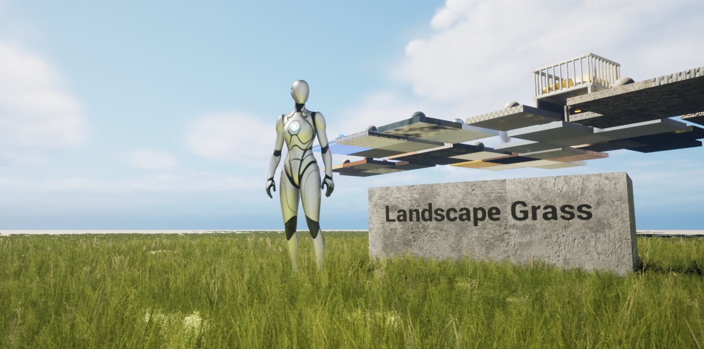

This article presents a method to reduce the memory footprint of Landscape Grass. By analyzing Landscape Grass as an excellent scene vegetation rendering solution, we can modify its planting pipeline to further optimize memory usage. This optimization has particularly significant effects on mobile devices, where it can save around 40% to 50% of Landscape Grass memory usage.

> For a detailed analysis of the Landscape Grass principles, please refer to the previous blog: [UE5 Landscape Grass Source Analysis: A Look Under the Hood](/posts/a-look-under-the-hood-at-unreal-engine-landscape-grass-en)

## Optimization Approach: Visibility Culling

After analyzing the source code, we found that the generation of Landscape Grass is related to the position of the camera in the scene, but not to the camera's orientation. Therefore, all grass within a certain radius around the camera will be generated and stored in memory. On performance-constrained mobile devices, we can apply the concept of GPU visibility culling to optimize Landscape Grass memory usage. The fundamental principle of this optimization is to eliminate what is not needed.


In the above image, the red area represents the frustum region. Grass outside this region will be culled by the GPU, but the corresponding number of Grass Instances is still allocated in memory, leading to some waste.

Without affecting the gameplay, we can consider the following approach:

-   All grass in front of the camera's field of view should be generated because the player may move the camera, and grass in the distance continuously comes into view during forward movement.
-   Considering that grass is not updated every frame (as mentioned in the theoretical part regarding TickInterval and maximum AsyncTasks), we should avoid the sudden appearance or disappearance of grass in the distance while the player is moving forward.
-   We do not need to generate all the grass behind the camera's field of view. However, to avoid vegetation loss, we introduce a small Patch Zone (the yellow area in the image) behind the camera as a buffer to ensure that the grass behind the player is correctly loaded.
-   No grass should be planted in the remaining areas.
-   This approach does not consider the height in 3D space and is a 2D optimization solution.

## Filling the Gap

Grass Variety is generated based on Grass Subsections, and we need to consider some boundary cases.

A Grass Subsection is a quadrangle (not a Landscape Component Subsection), so it is natural to use the center of the subsection's projection in the $z$ direction as our starting point for calculations.

We have the Camera Forward vector $V_{cam}$, and let's assume that the vector from the starting point of $V_{cam}$ to the center $P$ of the subsection is $V_{sub}$ .

Therefore, the determination of the land blocks in front of the field of view is:

$$
V_{cam} \cdot V_{sub} > 0
$$

If the Camera Vector $V_{cam}$ is in front of the subsection, but some grass within the FOV is exposed, that portion of grass will disappear.


Dealing with this situation is relatively simple. We only need to check if the Camera is within the Bounding Box (AABB)[^AABB] of this subsection. When the Camera is within this subsection, forcefully load the grass on this block. However, considering the boundary cases where the camera is at the edge of the subsection, the grass on the neighboring blocks also disappears. We can modify the determination formula as follows:

$$
V_{cam} \cdot V_{sub} \geq 0
$$

[^AABB]: AABB stands for Axis-Aligned Bounding Box.

However, when $V_{cam} \cdot V_{sub} = 0$, an entire row of grass will also be loaded, which is obviously not the optimal solution we want. At the same time, the grass on the land blocks $V_{sub}$ where $V_{cam} \cdot V_{sub} \to 0-$ will also disappear:


We can make additional judgments based on the (shortest) distance from the Camera to the subsection, that is, the ratio of the distance from the tail of $V_{cam}$ to the AABB of the subsection and the size of the subsection's side length. This can control the loading of nearby grass on the land blocks.

However, such a complex algorithm may not be very pleasant to work with.

### Generalized Algorithm

Instead of considering whether the Camera is inside the subsection, we can use the following generalized algorithm:

Assuming the Distance Vector from the Camera to any vertex of the subsection is $V_d$, when $V_d \cdot V_{cam} > 0$, we can identify all the subsections located in the Camera's orthogonal direction and in front of it. Then, we check if the distance from the Camera to the AABB of the subsection is less than the side length of the subsection in order to load the nearby grass on the land blocks.


### Controlling Culling Granularity

If you think this is the end of the optimization solution, then you are _too young too simple_. Through the source code, we find that we have another variable called `GMaxInstancesPerComponent`, which is used to control the maximum number of instances per **subsection** (not semantically the landscape component...). The engine's default value is 65536 ($2^{16}$), with a lower limit of 1024 ($2^{10}$), and no upper limit.

> See previous article: [UE5 Landscape Grass Source Analysis: A Look Under the Hood](/posts/a-look-under-the-hood-at-unreal-engine-landscape-grass-en)

Therefore, the smaller the `GMaxInstancesPerComponent`, the more subsections there will be, and the grass density in the scene will appear slightly sparser. This also means that the granularity of culling is smaller, which benefits memory optimization.

By setting different values for `GMaxInstancesPerComponent` and comparing the number of built tasks before and after enabling the optimization algorithm, we can observe how it affects the grass generation process:

In the demo scene, based on the improved generation algorithm:

| `GMaxInstancesPerComponent`     | Built Tasks Before Optimization | Built Tasks After Optimization | Optimization Ratio |
| ------------------------------- | ------------------------------- | ------------------------------ | ------------------ |
| $2^{10}=1024$                   | 151                             | 87                             | 42.4%              |
| $2^{11}=2048$                   | 111                             | 66                             | 40.5%              |
| $2^{16}=65536$ (Engine Default) | 12                              | 10                             | 16.7%              |

We can see that `GMaxInstancesPerComponent` has a significant impact on the grass generation tasks and should not be set too large.

## Algorithm Implementation

_You can borrow my ideas, but do you really want to copy my code?_

Pseudocode for the core algorithm:

```cpp showLineNumbers
// Iterate over subsection vertices
for (Vector Vertex: SubsectionVertices)
{
	IsCameraBehindSubsection = IsCameraBehindSubsection || (
		(Vertex.X - CameraLocation.X) * CameraForward.X +
		(Vertex.Y - CameraLocation.Y) * CameraForward.Y) > 0);
}

if (!IsCameraBehindSubsection && DistanceFromBoxToPoint(Subsection, CameraLocation) > SubsectionWidth)
{
	// Don't spawn grass
}
else
{
	// Spawn grass
}
```

### Memory Testing

Based on theoretical analysis, our Landscape Grass memory usage can be reduced to approximately half of the original.

The author conducted ablation experiments on a demo scene and analyzed the number of specified vegetation StaticMesh instances to determine the memory size. The following are the experimental results:

| `GMaxInstancesPerComponent` | NumInstances Before Optimization | NumInstances After Optimization | Optimization Ratio |
| --------------------------- | -------------------------------- | ------------------------------- | ------------------ |
| $2^{10}=1024$               | 87595                            | 48642                           | 44.5%              |
| $2^{11}=2048$               | 99239                            | 58290                           | 41.3%              |

In another simple demo scene with less grass, a quick memory analysis was performed, and the optimization ratio was approximately 46.4%:

| Item                 | Memory [MB] | Built Tasks |
| -------------------- | ----------- | ----------- |
| Map without grass    | 582         | N/A         |
| Default algorithm    | 610         | 12          |
| Culling optimization | 595         | 10          |

The results are quite significant.

## Reference

1. [UE5 Landscape Grass Source Analysis: A Look Under the Hood](/posts/a-look-under-the-hood-at-unreal-engine-landscape-grass-en)
2. [《InsideUE4》GamePlay 架构（十一）Subsystems](https://zhuanlan.zhihu.com/p/158717151)
3. [UE4 Mobile Landscape 总览及源码解析](https://zhuanlan.zhihu.com/p/144031549)
4. [UE4 中的植被工具](https://zhuanlan.zhihu.com/p/389430858)
5. [LearnOpenGL - Instancing](https://learnopengl.com/Advanced-OpenGL/Instancing)
6. [UE4 材质系统](https://papalqi.cn/ue4材质系统/)
7. [Halton Sequence](https://web.maths.unsw.edu.au/~josefdick/MCQMC_Proceedings/MCQMC_Proceedings_2012_Preprints/100_Keller_tutorial.pdf)

## Citation
