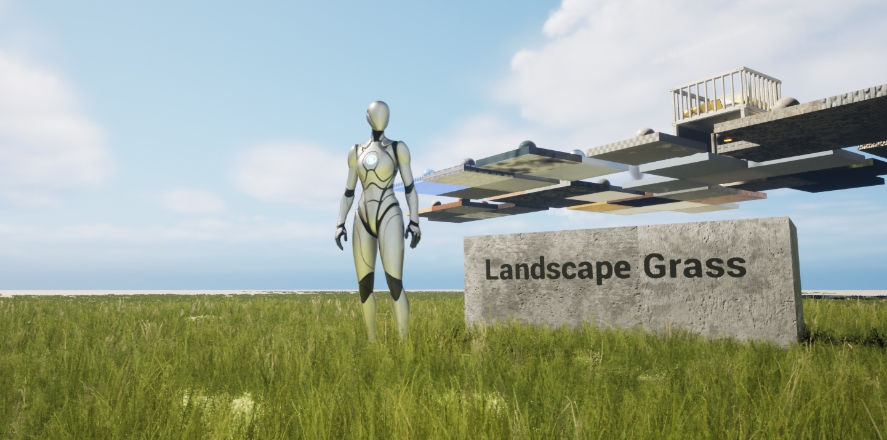
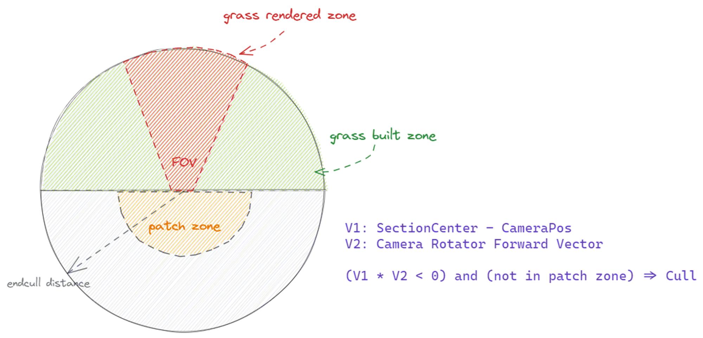
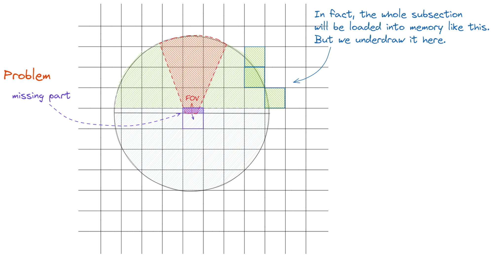
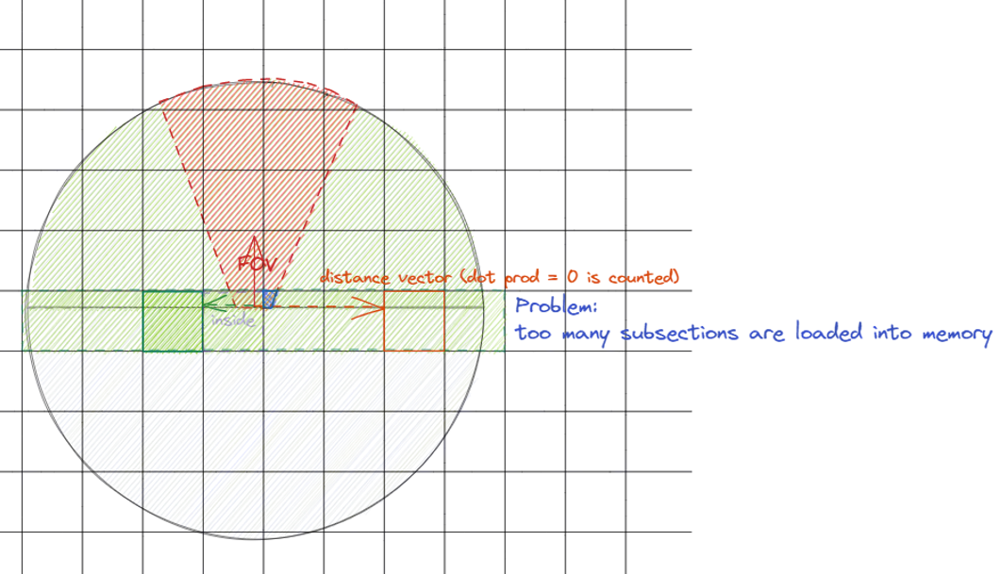
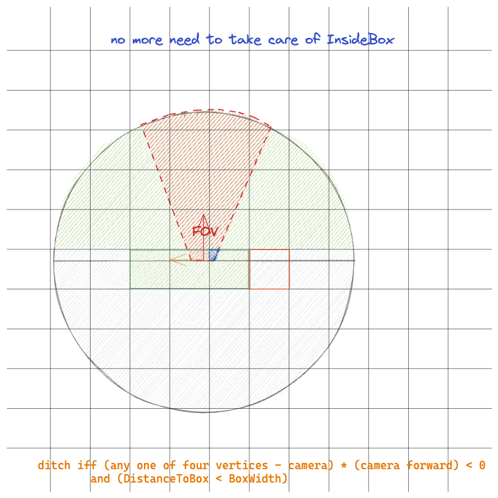

本文提供一种降低 Landscape Grass 内存占用的方式，分析 Landscape Grass 作为优秀的场景植被渲染方案，我们可以尝试修改其种植流程管线来进一步优化内存，尤其是在移动端设备上可以有比较客观的效果，可以节省 40%～ 50% 的 Landscape Grass 内存占用。

> Landscape Grass 原理分析详见前文：[UE5 Landscape Grass 地形草原理分析](/posts/a-look-under-the-hood-at-unreal-engine-landscape-grass)

## 优化方案：Visibility Culling

源码分析得知，Landscape Grass 的生成和场景中 Camera 位置相关，但和 Camera 的朝向无关，因此，以 Camera 为中心一定半径内草地都会被生成到内存当中。在性能吃紧的移动设备上，我们可以通过类比 GPU Visibility Culling 的思想来对 Landscape Grass 做内存优化，即优化的第一性原理——不需要的就砍掉。



上图中的红色区域即为视锥 (Frustum) 内区域，区域外的草会被 GPU 剔除，但在内存中我们仍然申请分配对应数量的 Grass Instance, 带来了一定浪费。

在不影响游戏业务的场景下，我们可以考虑如下方案：

-   Camera 视野前方的所有草地应该被生成，因为玩家会晃动视角，在向前移动过程中远处的草在不断的被载入视野范围。
-   考虑到草地不是每一帧更新的（原理部分提到的 TickInterval 和最大 AsyncTasks），我们要避免在玩家向前移动的过程中感受到远处草地的瞬间生成（或消失）。
-   Camera 视野后方的草地我们不需要全部生成，但同时为了避免植被丢失，我们在 Camera 后加入一小块 Patch Zone (上图黄色区域) 作为缓冲，确保玩家身后的草地也能正确被载入。
-   其余区域不进行种草。
-   该方案不考虑三维空间高度，是一个二维的优化方案。

## 填坑过程

Grass Variety 是基于 Grass Subsection 进行生成，我们需要考虑到一些边界情况。

Grass Subsection 是一个 quadrangle (不是 Landscape Component Subsection), 自然想到可以用到 subsection 在 $z$ 方向投影的中心作为我们的计算起点。

我们有 Camera Forward $V_{cam}$，假设 $V_{cam}$ 的起点到 subsection 中心 $P$ 的向量为 $V_{sub}$

所以有视野前方的地块判定方式为：

$$
V_{cam} \cdot V_{sub} > 0
$$

倘若 Camera Vector $V_{cam}$ 的起点[^vector3to2] 存在 subsection 前方，但同时 FOV 内暴露了部分草地，这一部分的草地会消失。

[^vector3to2]: 优化方案忽略高度，向量指的是三维向量 $V$ 在 $z$ 方向的投影分量 $V_{z}$



这里的处理办法很容易，我们只需要判断 Camera 是不是处于这一个 subsection 的 Bounding Box (AABB)[^AABB] 内即可，当 Camera 处于这个 subsection, 强行加载这个块上的草即可。但考虑边界情况，相机在 subsection 的边缘，旁边的地块草也同样消失了，我们可以通过修改判定公式：

$$
V_{cam} \cdot V_{sub} \geq 0
$$

[^AABB]: AABB, Axis-Aligned Bounding Box, 轴对齐包围盒

但 $V_{cam} \cdot V_{sub} = 0 $ 时，一整排的草地也会被载入，这显然不是我们想要的最优解。同时， $V_{cam} \cdot V_{sub} \to 0- $ 的地块 $V_{sub}$ 草同样会消失：



我们可以加以判断，Camera 到 subsction 的（最短）距离，即 $V_{cam}$ 的 tail 到 subsection AABB 的距离和 subsection 边长的大小之比来控制载入附近的地块草。

但这样复杂的算法听起来有点不是那么令人愉悦。

### 算法通解

不用考虑 Camera 是否在 subsection 内，我们可以有如下的通用算法：

假设 Camera 到 subsection 的任意顶点的 Distance Vector 为 $V_{d}$, 当 $V_{d} \cdot V_{cam} > 0$ 我们可以得到位于 Camera 正交方向和前方的所有 subsection, 再判断 Camera 到 subsection AABB 的距离是否小于 subsection 边长，来载入附近的地块草。



### 控制剔除粒度

如果以为这就是优化方案的结束，那你就 too young too simple 了，由源码分析可得我们还有一个变量 `GMaxInstancesPerComponent` 用于控制每个 **subsection** 上的最多 instance 数量（并不是语义上的 landscape component... ），引擎默认设置为 65536 ($2^{16}$)，下限为 1024 ($2^{10}$)，没有上限。

> 详见前文：[UE5 Landscape Grass 地形草原理分析](/posts/a-look-under-the-hood-at-unreal-engine-landscape-grass)

所以 GMaxInstancesPerComponent 越小，subsection 数量越多，草的场景密度看起来更略微稀疏，剔除的粒度也就越小，利好内存优化。

我们设置不同的 `GMaxInstancesPerComponent` ，通过启用优化算法前后对比 Built Tasks 数量来看它会如何影响种草过程：

Demo 场景下根据改进后的生成算法，

| `GMaxInstancesPerComponent` | 优化前 Built Tasks | 优化后 Built Tasks | 优化比 |
| --------------------------- | ------------------ | ------------------ | ------ |
| $2^{10}=1024$               | 151                | 87                 | 42.4%  |
| $2^{11}=2048$               | 111                | 66                 | 40.5%  |
| $2^{16}=65536$ (引擎默认)   | 12                 | 10                 | 16.7%  |

可以看到 `MaxInstancesPerComponent` 对种草任务有显著影响，不宜设置过大。

## 算法实现

_白嫖我的思路就好了，还想白嫖代码？_

核心算法伪代码：

```cpp showLineNumbers
// 遍历 subsection 顶点
for (Vector Vertex: SubsectionVertices)
{
	IsCameraBehindSubsection = IsCameraBehindSubsection || (
		(Vertex.X - CameraLocation.X) * CameraForward.X +
		(Vertex.Y - CameraLocation.Y) * CameraForward.Y) > 0);
}

if (!IsCameraBehindSubsection && DistanceFromBoxToPoint(Subsection, CameraLocation) > SubsectionWidth)
{
	// 不种草
}
else
{
	// 种草
}
```

## 内存测试

理论分析，我们的 Landscape Grass 内存大约能减少到原先的一半左右。

笔者在 demo 上做了消融实验，通过分析指定的植被 StaticMesh Instance 数量来判断内存大小，以下是实验结果。

| `GMaxInstancesPerComponent` | 优化前 NumInstances | 优化后 NumInstances | 优化比 |
| --------------------------- | ------------------- | ------------------- | ------ |
| $2^{10}=1024$               | 87595               | 48642               | 44.5%  |
| $2^{11}=2048$               | 99239               | 58290               | 41.3%  |

在另一个简单 demo 里（草比较少）下做了快速的内存分析，优化比大约在 46.4%：

| Item         | Memory [MB] | Built Tasks |
| ------------ | ----------- | ----------- |
| 没有草的地图 | 582         | N/A         |
| 引擎默认算法 | 610         | 12          |
| 剔除优化算法 | 595         | 10          |

效果还是蛮可观的。

## 参见

1. [UE5 Landscape Grass 地形草原理分析](/posts/a-look-under-the-hood-at-unreal-engine-landscape-grass)
2. [《InsideUE4》GamePlay 架构（十一）Subsystems](https://zhuanlan.zhihu.com/p/158717151)
3. [UE4 Mobile Landscape 总览及源码解析](https://zhuanlan.zhihu.com/p/144031549)
4. [UE4 中的植被工具](https://zhuanlan.zhihu.com/p/389430858)
5. [LearnOpenGL - Instancing](https://learnopengl.com/Advanced-OpenGL/Instancing)
6. [UE4 材质系统](https://papalqi.cn/ue4材质系统/)
7. [Halton Sequence](https://web.maths.unsw.edu.au/~josefdick/MCQMC_Proceedings/MCQMC_Proceedings_2012_Preprints/100_Keller_tutorial.pdf)

## Reference
