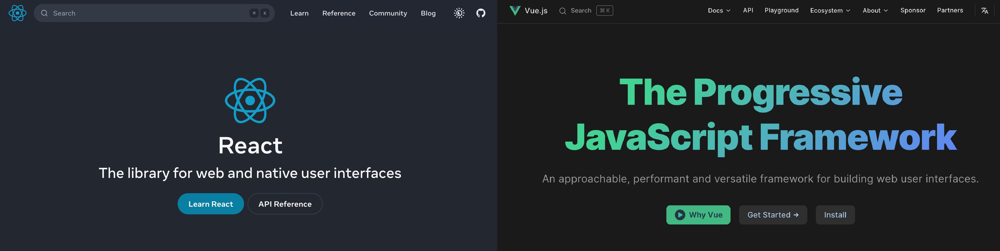

I have been blogging since 2017 when I was young. Over the years, I have used many blogging systems, some dynamic ones mostly written in PHP, such as WordPress and Typecho, and some static ones like Hexo and Hugo. The two approaches have their own pros and cons. Ultimately, I transitioned from dynamic blogging platforms to a fully static website.

I love exploring new things, and recently I have been delving into React, and [Next.js](https://nextjs.org/), a React framework dedicated to web development. I think it's the time to build a brand-new website based on it.

## The initiative

For the past six years, I've had an online blog that has remained largely neglected. Rather than actually blogging, I found myself endlessly tinkering with the system itself - switching between platforms and themes, tweaking servers and plugins. As I delved deeper into the world of web technologies, I started to care more about user interface, website accessibility, and performance. My latest iteration was built with [Hugo](https://gohugo.io/), though I hadn't actually updated the content since 2020.

Lately, it dawned on me that none of these technical optimizations mattered if I wasn't actually expressing myself. A blog, after all, should be an outlet to share your voice, not just a platform to endlessly experiment on. I realized it was time to get back to basics and build a space for recording my experiences, sharing insights from work and life, and simply writing with purpose again.

So I made the decision to start from scratch. Build a new blog, with a renewed vision - a place to discover and nurture my own voice. The technology powering it almost seems secondary now, but I still wanted to build something that was fast, accessible, and easy to maintain. This new blog represents a fresh start on a journey to rediscover myself. The blog I always meant to have, beyond any flash or fanfare, with writing at its heart.

## Dynamic vs. Static

I'm loving life with a static website now after switching from those dynamic ones like WordPress. Sure, those had their perks:

-   Easy to set up and use, just install on VPS and you are ready to go
-   Tons of plugins and themes with many free options
-   Supported by a huge community
-   Just write and publish

However, dynamic websites also came with some significant downsides:

-   Costly to maintain over time, with recurring VPS and domain fees
-   Potential security vulnerabilities required constant updates to fix
-   Backups and disaster recovery were complicated by the database-driven structure

After digging in some static site generators (SSG), I found that they are much more suitable for my needs:

-   Free to host on GitHub Pages, Vercel, Netlify, or any other static hosting service
-   No database means increased security and no backend to maintain
-   Full autonomy over my site and content, I do what I want
-   Easy to backup and restore using Git

## What I deprecated and Why

Hexo and Hugo are both excellent static site generators. Hexo suits blogs well, while Hugo is more versatile and faster than Hexo (Hugo allegedly the world's fastest SSG). Initially, I was content with Hugo. However, I found it difficult to customize themes and work within the constraints of its templates, I don't feel the full control of the website. I also became enamored with the idea of Frontend Engineering, and wanted to build a website with React.

### Why React and Next.js?


_React aims at user interfaces_

Ok, to be honest, I love Vue.js as well as React, Vue.js feels more intuitive and easier to learn, **Vue 3 is fantastic**. However, React is more widely used and has a larger community, and I'm keen to dive deeper into React (🤩 go to see their [latest doc here](https://react.dev/)). I also looked at VuePress, Gatsby, Astro, and Svelte, but Next.js is the most mature with the best documentation, whether you're just getting into web dev or you've been doing it for years. Next.js also provides many out-of-box optimizations, here's some ideas I love:

-   Next.js pre-renders pages ahead of requests (Server-side rendering, SSR) which proviedes fast and responsive blog site experience
-   Images optimization `next/image` and lazy loading components
-   Built-in Sass support and component-level styling
-   File-system based routing and intuitive URLs organization

### Looking for solutions

A great way to begin a new project is researching exisiting solutions - they may have already sovled issues you'll face. [Pliny](https://github.com/timlrx/pliny) is one option for a Next.js CMS, using Contentlayer for modeling. Check out [Spencer's blog](https://spencerwoo.com/) for inspiration.

Ultimately, I chose [Nextra](https://nextra.site/) - another reason I stuck with Next.js. It bridges Next.js and MDX (Markdown with React components). Many docs sites are built with it, such as [Turbo](https://turbo.build/) and [SWR](https://swr.vercel.app/). Though Nextra supports basic blogging features, I customized it extensively for my needs.

## The new website

The plan is Next.js + Nextra, and some spicies addon, so let's take a first view of the project structure.

### Structure

This is a typical Next.js project which incorporates spices of TypeScript, UnoCSS and other customizations that I will discuss later.

```bash {3-8}
.
├── public
├── src
│   ├── components
│   ├── data
│   ├── layouts
│   ├── pages
│   └── styles
├── lefthook.yml
├── next-env.d.ts
├── next.config.js
├── package.json
├── pnpm-lock.yaml
├── theme.config.jsx
├── tsconfig.json
├── unocss.config.ts
└── vercel.json
```

-   The `layout` and `styles` directories contain stayling and layout components for the blog theme.
-   The `pages` holds the posts and pages in MDX format. MDX allows writing markdown seamlessly with interactive react components.
-   The `components` enabled by MDX are used to enhance the content within pages and posts. (For example, [Friends](/friends) page uses a custom component within Markdown.)

### Nextra

### Theme and UnoCSS

### Post Management

#### Git

#### DecapCMS (formerly Netlify CMS)

### Comment System

cusdis is out-of-box with Nextra Blog Theme,

## Future work

some of ...
